<div align="center">
  
  
  <h1>EGM Downloader</h1>
  
  <p>
    
    
    
    
    
    <a href="https://www.gnu.org/licenses/agpl-3.0"></a>
    <a href="https://github.com/egmtm/EGM-Downloader/discussions"></a>
    
    
    
    
    
    
  </p>

  <p><strong>A powerful, multi-platform video and audio downloader for 1000+ websites.</strong></p>
  
  <p>Download videos or extract audio from YouTube, TikTok, Instagram, Twitter, Facebook, and hundreds of other platforms with a beautiful, easy-to-use interface.</p>
  <p><em>Powered by yt-dlp · runs locally · no cloud · no tracking · no accounts</em></p>
</div>

---

<p align="center">
  <a href="#-download">⬇ Downloads</a> ·
  <a href="#️-screenshots">📸 Screenshots</a> ·
  <a href="#-quick-start">🚀 Quick Start</a> ·
  <a href="#️-roadmap">🗺️ Roadmap</a> ·
  <a href="#-system-requirements">📋 Requirements</a>
</p>

## ✨ Features

- 🌐 **1000+ Supported Sites** - Download from YouTube, TikTok, Instagram, Twitter, Vimeo, and more
- 🎬 **Video & Audio Downloads** - MP4 or MKV video; MP3, M4A, OPUS, or FLAC audio
- 📊 **Quality Selection** - Video up to 8K/4K/2K/1080p; audio up to FLAC or 320 kbps MP3
- 📋 **Playlist Support** - Download entire playlists with one click
- ⚡ **Batch Downloads** - Queue multiple URLs and download them all at once
- 🖱️ **Drag & Drop + Keyboard Shortcuts** - Drop URLs directly into the app; Ctrl+V / ⌘V fetches, Ctrl+Enter / ⌘Return starts, Esc clears
- 🎨 **400 Themes** - 390 permanent across 20+ categories + 10 seasonal easter eggs with smooth transitions
- 📜 **Download History** - Track all downloads with search, filter, and re-download capability
- 🔤 **Subtitles & Metadata** - Embed subtitles and rich metadata (thumbnail, chapters, title/artist/date) directly into video files
- 🔄 **Auto-Updates** - Built-in update checker with SHA256 checksum verification (Windows/Mac)
- 📝 **Custom Filenames** - Edit filenames before downloading
- 🛠️ **Plugin Updates** - Update yt-dlp and ffmpeg without reinstalling
- 🧹 **Smart Cleanup** - Automatic removal of temporary files and failed downloads
- 💼 **Windows Portable** - Run from any folder or USB drive — no installer, no registry
- 🖥️ **Cross-Platform** - Native apps for Windows, macOS, and Linux
- 🔒 **Privacy First** - Runs entirely on your machine. No account required, no cloud processing, no analytics, no data transmitted anywhere. Site cookies are handled locally and never pass through our servers or any other network.

---

## 🖼️ Screenshots

> 📸 *Screenshots captured on v1.0.4 — Sharp. The UI is identical across Windows, macOS, and Linux.*

<table>
  <tr>
    <td align="center" width="50%">
      <a href="screenshots/01-main-ui-the-10s-theme.png">
        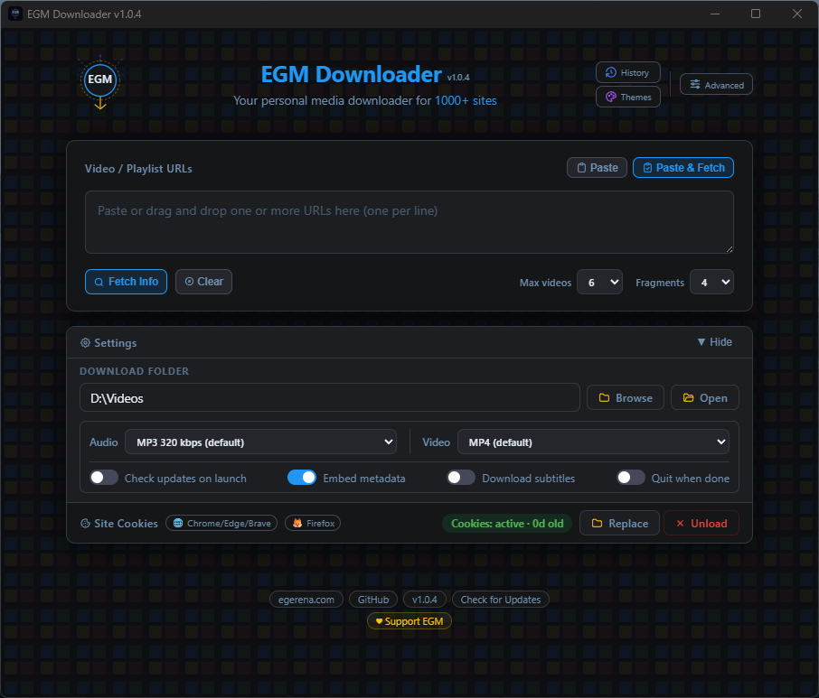
      </a>
      <br/><sub><b>Main UI — The 10s Theme</b></sub>
    </td>
    <td align="center" width="50%">
      <a href="screenshots/02-main-ui-settings-hidden-millenium-bug-theme.png">
        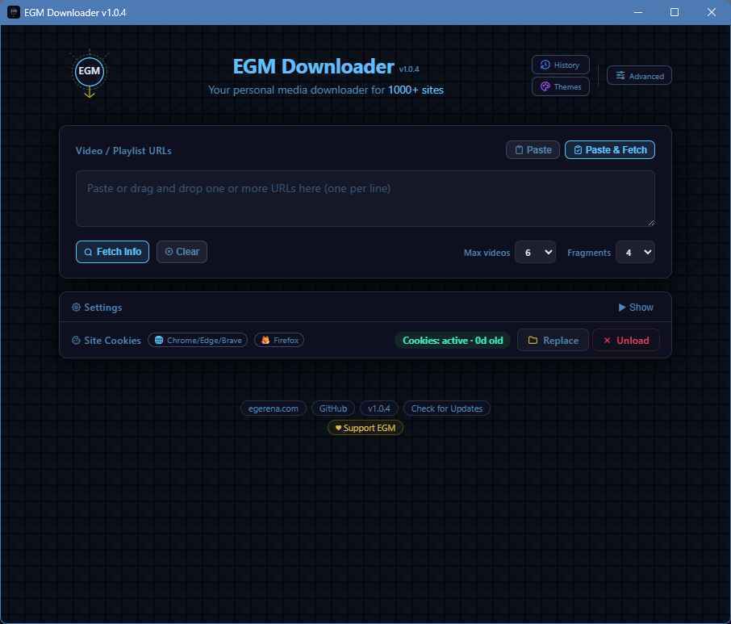
      </a>
      <br/><sub><b>Main UI — Millennium Bug Theme</b></sub>
    </td>
  </tr>
  <tr>
    <td align="center">
      <a href="screenshots/03-fetching-videos-ghost-theme.png">
        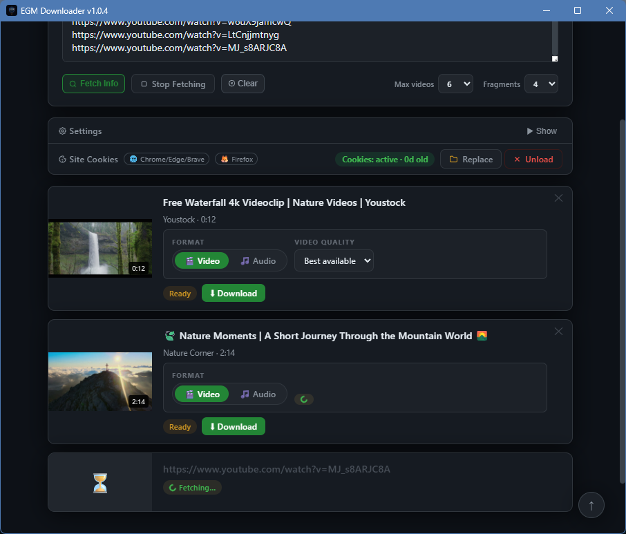
      </a>
      <br/><sub><b>Fetching Videos — Ghost Theme</b></sub>
    </td>
    <td align="center">
      <a href="screenshots/04-download-all-videos-zion-theme.png">
        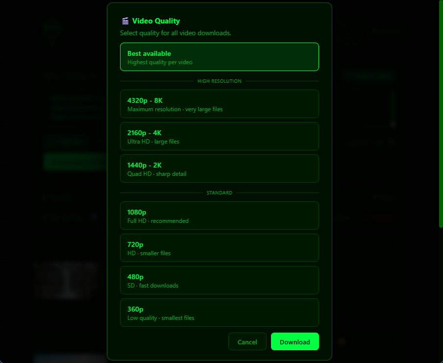
      </a>
      <br/><sub><b>Download All Videos — Zion Theme</b></sub>
    </td>
  </tr>
  <tr>
    <td align="center">
      <a href="screenshots/05-downloading-videos-midnight-theme.png">
        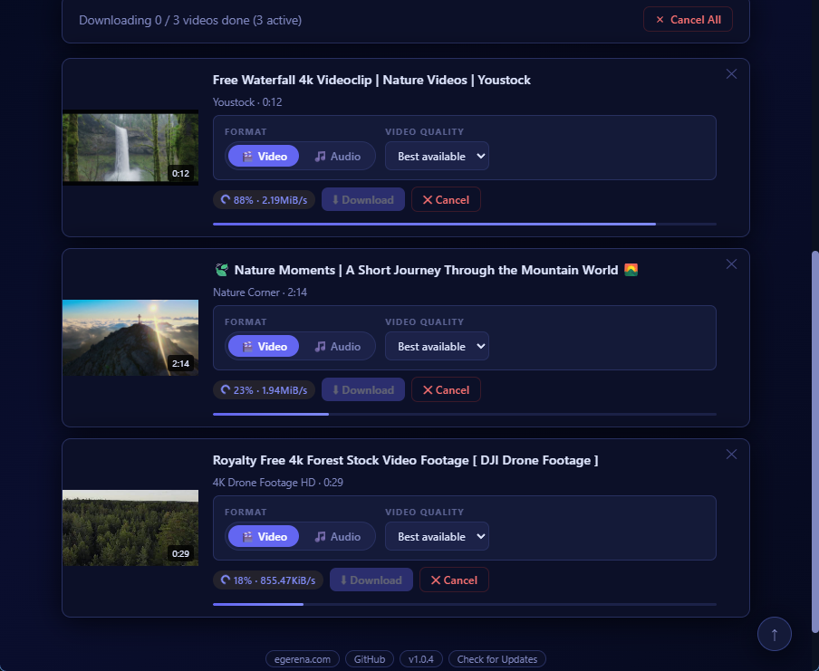
      </a>
      <br/><sub><b>Downloading Videos — Midnight Theme</b></sub>
    </td>
    <td align="center">
      <a href="screenshots/06-download-history-la-guancha-theme.png">
        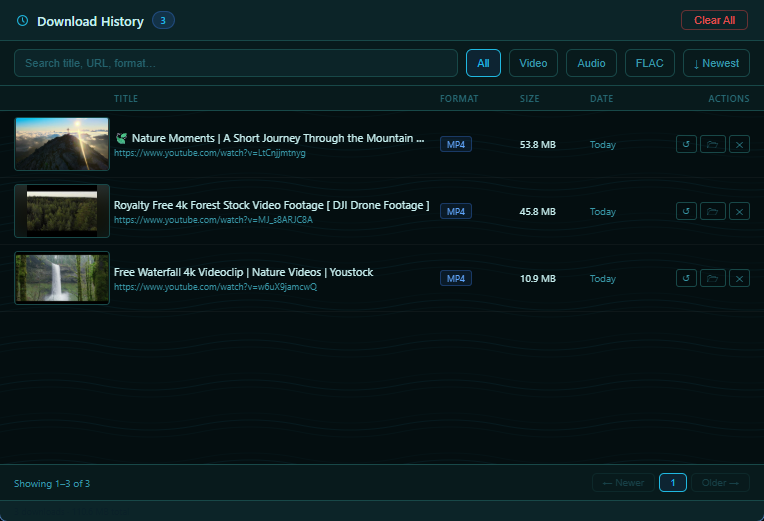
      </a>
      <br/><sub><b>Download History — La Guancha Theme</b></sub>
    </td>
  </tr>
  <tr>
    <td align="center">
      <a href="screenshots/07-themes-main-ui-the-witness-theme.png">
        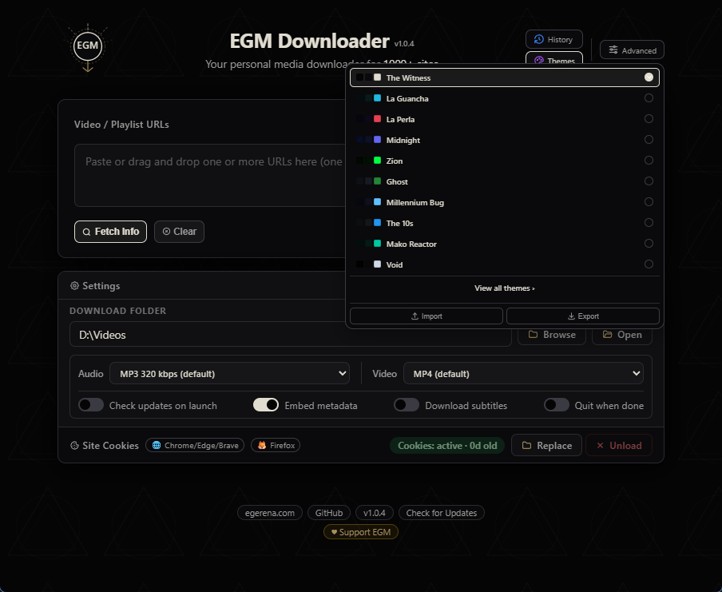
      </a>
      <br/><sub><b>Themes Window — The Witness Theme</b></sub>
    </td>
    <td align="center">
      <a href="screenshots/08-all-themes-n64-theme.png">
        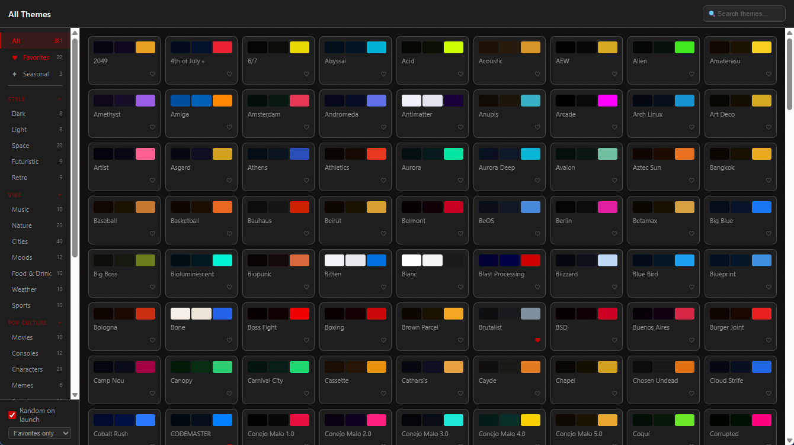
      </a>
      <br/><sub><b>All Themes — N64 Theme</b></sub>
    </td>
  </tr>
  <tr>
    <td align="center">
      <a href="screenshots/09-advanced-options-old-san-juan-theme.png">
        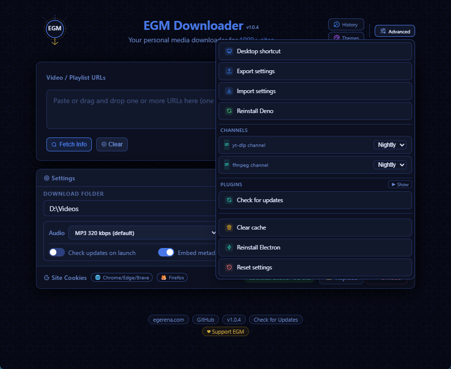
      </a>
      <br/><sub><b>Advanced Options — Old San Juan Theme</b></sub>
    </td>
    <td align="center">
      <a href="screenshots/10-plugins-update-advanced-bauhaus-theme.png">
        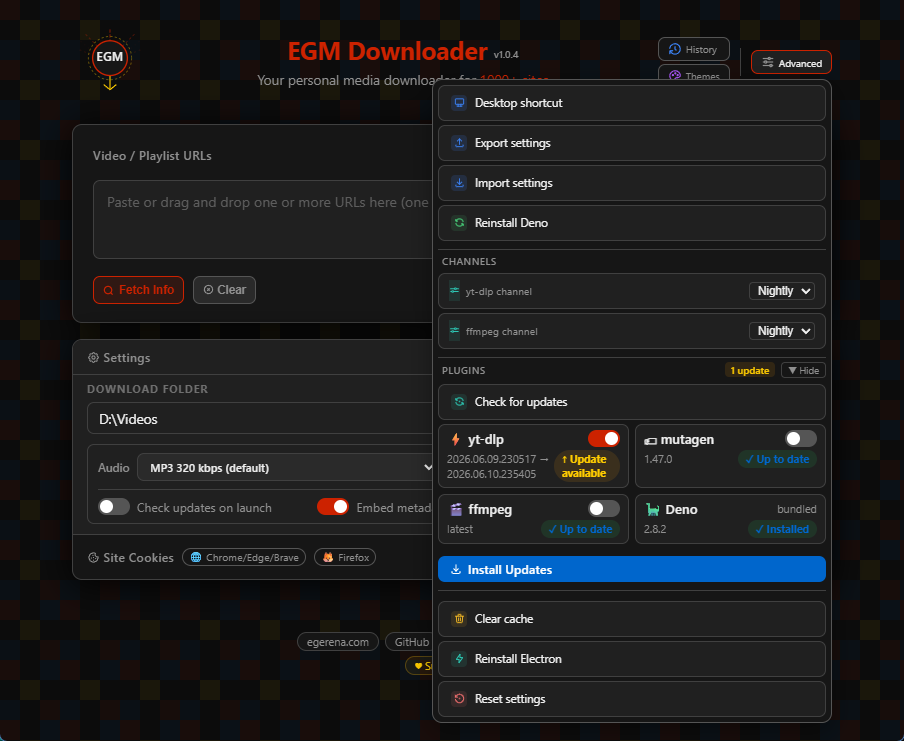
      </a>
      <br/><sub><b>Plugins Update — Bauhaus Theme</b></sub>
    </td>
  </tr>
  <tr>
    <td align="center">
      <a href="screenshots/11-plugin-update-success-brutalist-theme.png">
        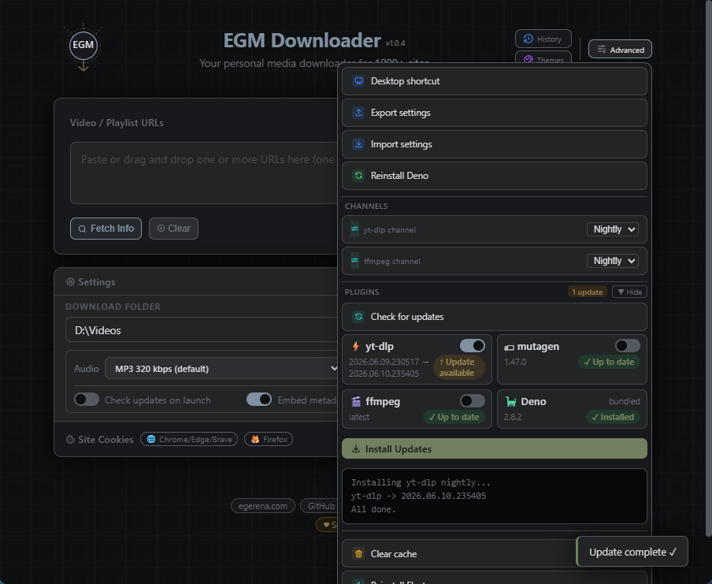
      </a>
      <br/><sub><b>Plugin Update Success — Brutalist Theme</b></sub>
    </td>
    <td align="center">
      <a href="screenshots/12-deno-reinstall-button-blue-bird-theme.png">
        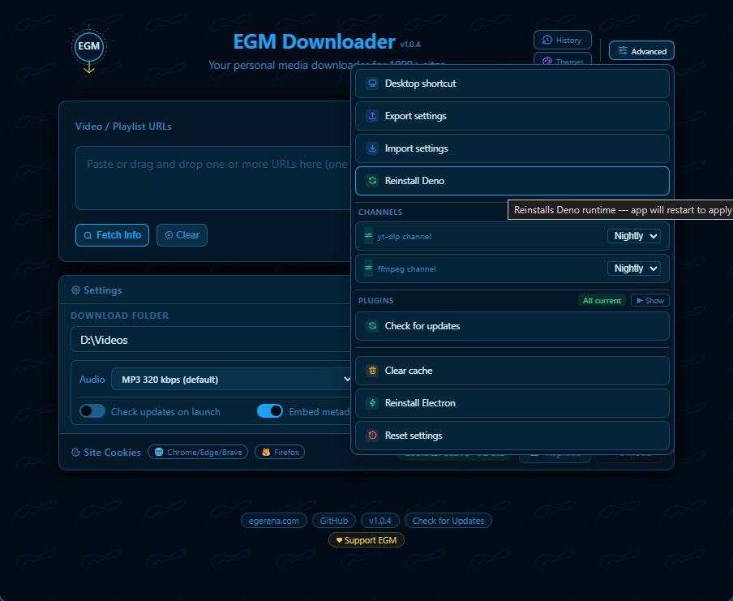
      </a>
      <br/><sub><b>Deno Reinstall — Blue Bird Theme</b></sub>
    </td>
  </tr>
</table>

## 📥 Download

### Windows
**Latest:** v1.0.4 Build 128  
**Download:** [EGMd.zip](https://egerena.com/apps/EGMd.zip) (422 KB · ~800 MB after install)  
**SHA256:** `45c8010b75cf9c6f5d4212b064cda8f6981a879ca559e52427d3bf89dbac41bb`  
**Requirements:** Windows 10/11 (64-bit)  
**Code Signed:** Installer is signed with an IV certificate (SSL.com) — SmartScreen warnings may still appear until the certificate builds reputation. EV certificate planned for broader recognition.

### Windows Portable
**Latest:** v1.0.4 Build 128  
**Download:** [EGMd-portable.zip](https://egerena.com/apps/EGMd-portable.zip) (394 KB · ~800 MB after first run)  
**SHA256:** `70b8f8f77b7408083860633c69b1ea9017ec9c1bb42cae3d53f541f9f3c8462b`  
**Requirements:** Windows 10/11 (64-bit)  
**No installer, no registry** — runs from any folder or USB drive  
**Code Signed:** Portable is signed with an IV certificate (SSL.com) — SmartScreen warnings may still appear until the certificate builds reputation. EV certificate planned for broader recognition.

### macOS
**Latest:** v1.0.4 Build 128  
**Download:** [EGMdM.zip](https://egerena.com/apps/EGMdM.zip) (128 MB · ~300 MB after install)  
**SHA256:** `82c678fb51003a11e781baf71d017c80f3fe8c6aaae3740a55bfb3e6cdeef924`  
**Requirements:** macOS 11.0 (Big Sur) or later · Apple Silicon (M1–M5) only
**Signed & Notarized:** This build is Apple notarized — runs without Gatekeeper warnings

### Linux
**Latest:** v1.0.4 Build 128  
**Download:** [EGMdL.zip](https://egerena.com/apps/EGMdL.zip) (144 MB · ~300 MB after install)  
**SHA256:** `120a7b0693ad6d19998c2cd0353548ff4beb60ae4de9366ccb864dbc2a6ae6a7`  
**Format:** AppImage (Universal)  
**Supported Distros:** Ubuntu 20.04+, Mint 20+, Pop!_OS, Fedora 39+, Arch, and more

> **Note:** Distributions available on [apps.egerena.com](https://apps.egerena.com)

---

## 🚀 Quick Start

### Windows
1. Extract `EGMd.zip`
2. Run `egm-setup.exe` and follow the installer
3. Paste a video URL and click Download!

### Windows Portable
1. Extract `EGMd-portable.zip` to any folder or USB drive
2. Run `EGM Downloader.exe`
3. Paste a video URL and click Download!

> Settings and data stay in the same folder — take it anywhere.

### macOS
1. Extract `EGMdM.zip`
2. Open the `.dmg` file
3. Drag "EGM Downloader" to Applications
4. Launch from Applications folder

### Linux
1. Extract `EGMdL.zip`
2. Make executable: `chmod +x "EGM Downloader.AppImage"`
3. Double-click to launch (or run from terminal)

**Windows only — first launch:** The installer downloads runtime components (Node.js, Electron, ffmpeg) once into your user data directory (~250 MB). macOS and Linux bundle these dependencies inside the package — no first-launch download required (which is why their file sizes are larger).

---

## 💡 Usage

1. **Paste URL** - Copy any video URL and paste it into the app and click "Fetch", or after copying video, click "Paste & Fetch"
2. **Select Format** - Choose video (MP4 or MKV) or audio (MP3, M4A, OPUS, or FLAC)
3. **Select Quality** - Choose resolution (up to 8K) or audio bitrate
4. **Edit Filename** (Optional) - Click the filename to customize it
5. **Download** - Click the download button and wait for completion
6. **Open Folder** - Click "Open Folder" to view your downloaded files

### Advanced Features

**Playlist Downloads:**
- Paste playlist URL
- Select "Download All" or choose specific videos, select your resolution, also you can "Download All Audio" and select your desired bitrate
- Videos/Audio download in sequence

**Batch Downloads:**
- Add multiple URLs to the queue
- Select format (MP4/MP3) and quality for each
- Download all at once
- Cancel individual downloads anytime

**Plugin Updates:**
- Click "Update Plugins" in Advanced Settings
- Update yt-dlp for newest site support
- Update ffmpeg for latest codecs

**Cookies / Login-Required Content:**
- Some sites require browser cookies for premium or age-restricted content
- Import cookies from Chrome, Edge, Brave, or Firefox directly in the app
- Cookies are stored locally on your machine and are never transmitted

---

## 🗺️ Roadmap

**v0.99.9 — COMMAND CENTER:** ✅ Shipped
Advanced panel in hamburger, splash polish, +20 themes

**v0.99.10 — DIRECTOR'S CUT:** ✅ Shipped
Video thumbnails in history, expanded audio quality, +20 themes

**v0.99.11 — FOUNDER'S EDITION:** ✅ Shipped
Puerto Rico Collection (22 themes), 67 new themes total, HTTPS-only thumbnail fetching

**v0.99.12 — VAULT:** ✅ Shipped
Signed update manifests, security event logging, unit test suite (13 tests), contrast fixes

**v0.99.13 — SOLID:** ✅ Shipped
Atomic file writes, strict image magic byte validation, Content-Type enforcement on thumbnails

**v1.0 — CORNERSTONE:** ✅ Shipped — [Release notes ↗](https://github.com/egmtm/EGM-Downloader/releases/tag/v1.0.0)
400 themes, YouTube fix, Theme Favorites, keyboard navigation, IPC hardening, 32 tests, source split, Electron 42.3.2

**v1.0.1:** ✅ Shipped — [Release notes ↗](https://github.com/egmtm/EGM-Downloader/releases/tag/v1.0.1)
Plugins panel moved to Advanced tab, collapsible grid, scroll-safe modal

**v1.0.2:** ✅ Shipped — [Release notes ↗](https://github.com/egmtm/EGM-Downloader/releases/tag/v1.0.2)
Direct-access nav buttons, enlarged logo, history panel fix

**v1.0.3 — Locksmith:** ✅ Shipped — [Release notes ↗](https://github.com/egmtm/EGM-Downloader/releases/tag/v1.0.3)
Concurrency backstop, path traversal fix, TOCTOU locks, Electron 42.4.0 + CVE-2026-9115/9116

**v1.0.4 — Sharp:** ✅ Shipped — [Release notes ↗](https://github.com/egmtm/EGM-Downloader/releases/tag/v1.0.4)
Full SVG icon upgrade, 2-column nav layout, card toggle contrast fix

**v1.1 — IGNITION:**
- 📡 Subscriptions — save any channel or playlist, automatically fetch and display what's new
- 🗂️ Dedicated subscriptions window — sidebar list, detail pane, collapsible, size/position remembered
- 🖼️ Video list with thumbnails, durations, and upload dates — sortable by Latest or Oldest
- 📄 Client-side pagination — 20 videos shown, Load More adds 20 at a time
- 🔄 Auto-fetch-on-open toggle per channel — selects and fetches automatically on window open
- 🔒 Per-channel download folder validated on save — rejects system roots, traversal, unwritable paths
- ⚙️ Site Cookies merged into Settings panel — one toggle controls both
- 🧪 Preload bridge parity test broadened — full function surface locked across all 3 platforms
- The engine fires here. Subscriptions touch backend, UI, and update flow — given room to land right

**v1.2 — [TBD]:**
- 🔭 Next chapter — details after v1.1 ships
- 🧩 *Browser extension in the works — send URLs straight to EGM Downloader without leaving your browser. Details TBD.*

**v1.3 — POLYGLOT:**
- 🌍 In-app language picker — multi-language support, clean and unhurried
- 10 languages at launch: Arabic, German, English, Spanish, French, Italian, Japanese, Dutch, Portuguese, Russian (AR · DE · EN · ES · FR · IT · JA · NL · PT · RU)

**See:** [GitHub Issues](https://github.com/egmtm/EGM-Downloader/issues) for details and progress.

---

## 📖 The Origin Story

EGM Downloader was born from inspiration and a desire to make video downloading accessible to everyone.

**The inspiration:** [ReClip](https://github.com/averygan/reclip) by [@averygan](https://github.com/averygan) beautifully demonstrated what's possible with yt-dlp and a clean web interface.

**The challenge:** ReClip's self-hosted approach is perfect for developers, but I wanted to share this with friends and family who don't use the terminal. Setting up Python, yt-dlp, ffmpeg, and Flask isn't everyone's cup of tea.

**The solution:** What if you could just download an app and go? No terminal. No dependencies. No setup. Just double-click and start downloading.

That's EGM Downloader—native desktop apps for Windows, macOS, and Linux with professional installers, auto-updates, and zero technical knowledge required.

We've taken the concept in a different direction (native apps vs. web-based, end-users vs. developers), but the core inspiration came from ReClip's elegant simplicity.

**Big thanks to [@averygan](https://github.com/averygan) for ReClip—you sparked the idea that became this project!** 🙏

**This is my first major project, and I'm excited to keep learning and building more tools that make technology accessible to everyone.** 🚀

---

## ⚖️ Legal & Responsible Use

EGM Downloader is a tool for downloading video content from the internet. While the software itself is legal, **you are responsible for how you use it.**

### Legitimate Uses

This tool is designed for lawful purposes, including:
- Downloading your own content
- Downloading Creative Commons or public domain content
- Fair use purposes (education, research, criticism, commentary)
- Archiving content you have permission to download
- Backing up content you own or have rights to
- Offline viewing in jurisdictions where personal downloading is legal

### Your Responsibilities

When using this tool, you must:
- **Respect copyright laws** - Only download content you have the right to download
- **Follow Terms of Service** - Many platforms prohibit downloading; check their policies
- **Obtain permission** - When required by law or platform rules
- **Use responsibly** - Do not redistribute, sell, or commercially exploit downloaded content without proper rights

### Disclaimer

**This tool is provided "as-is" for personal, lawful use only.**

The developers:
- Do not encourage or condone copyright infringement
- Are not responsible for how users choose to use this software
- Do not provide legal advice regarding what you can or cannot download
- Assume no liability for user actions or violations of third-party terms

**You are solely responsible for ensuring your use complies with applicable laws, regulations, and terms of service.**

If you're unsure whether your use case is legal, consult a legal professional in your jurisdiction.

---

## 🛠️ For Developers

### Repository Structure

```
EGM-Downloader/
│
├── app.py                          ← Flask backend         [shared — all platforms]
├── templates/                      ← UI templates          [shared — Windows + Mac]
│   ├── index.html                  ← Main UI shell
│   ├── index_scripts.html          ← JS extracted
│   ├── index_styles.html           ← CSS extracted
│   ├── theme_data.html             ← THEME_DATA + THEMES array
│   ├── history.html                ← Download history
│   ├── themes.html                 ← Theme picker
│   └── theme_styles.html           ← Theme CSS definitions
├── static/                         ← App icons             [shared — all platforms]
├── languages/                      ← i18n language files   [shared — all platforms]
│
├── windows/                        ← Windows platform files
├── mac/                            ← macOS platform files
├── linux/                          ← Linux platform files
├── scripts/                        ← Build automation
└── tests/                          ← Automated test suite
```

See [CONTRIBUTING.md](CONTRIBUTING.md) for the complete build guide, version management workflow, and CI details.

---

## 📦 Platforms

| Platform | Status | Build | Distribution | Auto-Update |
|----------|--------|-------|--------------|-------------|
| Windows (Installer) | ✅ Live | Build 128 | EGMd.zip | ✅ Yes |
| Windows (Portable)  | ✅ Live | Build 128 | EGMd-portable.zip | ❌ Manual |
| macOS    | ✅ Live | Build 128 | EGMdM.zip | ✅ Yes |
| Linux    | ✅ Live | Build 128 | EGMdL.zip | ❌ Manual |

### System Requirements

**Windows:** Windows 10/11 (64-bit) · ~800 MB disk space · Internet on first launch

**macOS:** macOS 11.0+ · Apple Silicon (M1–M5) · ~300 MB disk space

**Linux:** 64-bit distribution · ~300 MB disk space · FUSE support
Supported: Ubuntu 20.04/22.04/24.04/26.04, Mint 20/21/22, Pop!_OS 22.04, Zorin 16/17, elementary 7, Debian 11/12, KDE Neon, Fedora 39/40/41, openSUSE Leap 15.5/Tumbleweed, Rocky/AlmaLinux 9, Arch, Manjaro, EndeavourOS
> Ubuntu 22.04+ may require `libfuse2`: `sudo apt install libfuse2`

---

## 🏗️ Built With

EGM Downloader is powered by incredible open source projects:

- **[yt-dlp](https://github.com/yt-dlp/yt-dlp)** - Download engine (1000+ sites)
- **[bgutil-ytdlp-pot-provider](https://github.com/Brainicism/bgutil-ytdlp-pot-provider)** - YouTube PO Token generation (proof-of-origin)
- **[yt-dlp/ejs](https://github.com/yt-dlp/ejs)** - EJS remote components for YouTube signature solving
- **[Flask](https://flask.palletsprojects.com/)** - Web framework
- **[Electron](https://www.electronjs.org/)** - Cross-platform desktop wrapper
- **[FFmpeg](https://ffmpeg.org/)** - Video/audio processing
- **[Deno](https://deno.com/)** - JavaScript runtime for YouTube tokens
- **[mutagen](https://mutagen.readthedocs.io/)** - Audio metadata tagging (thumbnail, chapters, title/artist/date)

See [CREDITS.md](CREDITS.md) for complete acknowledgments and licenses.

---

## 🐛 Troubleshooting

**Windows — app won't start:** Run `launch.bat` to see error messages · check `logs/` folder

**macOS — download stuck:** Update plugins → restart the app → check Console.app for errors

**Linux — AppImage won't launch:**
- Ensure executable: `chmod +x "EGM Downloader.AppImage"`
- Install FUSE: `sudo apt install libfuse2` (Ubuntu/Debian)
- Run from terminal to see errors

**Need more help?** [Open an issue on GitHub](https://github.com/egmtm/EGM-Downloader/issues)

---

## 📜 License

This project is licensed under the **GNU Affero General Public License v3.0 (AGPL-3.0)** — see the [LICENSE](LICENSE) file for details.

- ✅ Free for personal and non-commercial use
- ✅ Modification and distribution allowed (must share modifications + source)
- ⚠️ Network use triggers copyleft

---

## 📞 Support & Security

- 🐛 **Bug Reports / Feature Requests:** [Open an Issue](https://github.com/egmtm/EGM-Downloader/issues)
- 📖 **Contributing:** [Read CONTRIBUTING.md](CONTRIBUTING.md)
- 🔒 **Security Vulnerabilities:** Do not open a public issue — email contact@egerena.com or use [GitHub's private vulnerability reporting](https://github.com/egmtm/EGM-Downloader/security/advisories/new). We'll respond within 48 hours.
