<div align="center">
  
  
  <h1>EGM Downloader</h1>
  
  <p>
    
    
    
    
    
    <a href="https://www.gnu.org/licenses/agpl-3.0"></a>
    <a href="https://github.com/egmtm/EGM-Downloader/discussions"></a>
    <a href="https://x.com/EGMDownloader"></a>
    
    
    
    
    
    
  </p>

  <p><strong>A powerful, multi-platform video and audio downloader for 1000+ websites.</strong></p>
  
  <p>Download videos or extract audio from YouTube, TikTok, Instagram, Twitter, Facebook, and hundreds of other platforms with a beautiful, easy-to-use interface.</p>
  <p><em>Powered by yt-dlp · runs locally · no cloud · no tracking · no accounts</em></p>
</div>

---

<p align="center">
  <a href="#-download">⬇ Downloads</a> ·
  <a href="#screenshots">📸 Screenshots</a> ·
  <a href="#-quick-start">🚀 Quick Start</a> ·
  <a href="#roadmap">🗺️ Roadmap</a> ·
  <a href="#system-requirements">📋 Requirements</a> ·
  <a href="https://x.com/EGMDownloader">🐦 @EGMDownloader</a>
</p>

## ✨ Features

- 🌐 **1000+ Supported Sites** - Download from YouTube, TikTok, Instagram, Twitter, Vimeo, and more
- 🎬 **Video & Audio Downloads** - MP4, MKV, or MP4 H.264 (max compatibility) video; MP3, M4A, OPUS, or FLAC audio
- 📊 **Quality Selection** - Video up to 8K/4K/2K/1080p; audio up to FLAC or 320 kbps MP3
- 📋 **Playlist Support** - Download entire playlists with one click
- ⚡ **Batch Downloads** - Queue multiple URLs and start all downloads together
- 📡 **Subscriptions** - Save channels and playlists, auto-fetch new videos, and download with per-channel settings and a live download queue
- 🎨 **450 Themes** - 428 permanent across 30 categories + 22 seasonal themes that rotate throughout the year. If you see fewer than 450, seasonal themes appear during their respective time of year.
- 🎨 **Theme Creator** - Build your own theme with 10 live-preview color pickers, export as `.json`, save directly to your library, favorite alongside built-in themes
- 🖱️ **Drag & Drop + Keyboard Shortcuts** - Drop URLs directly into the app; Ctrl+V / ⌘V fetches, Ctrl+Enter / ⌘Return starts, Esc clears
- 📜 **Download History** - Track all downloads with search, filter, and re-download capability
- 🔤 **Subtitles & Metadata** - Embed subtitles and rich metadata (thumbnail, chapters, title/artist/date) directly into video files
- 📝 **Custom Filenames** - Edit filenames before downloading
- 💼 **Settings Export / Import** - Back up and restore your settings and subscriptions
- 🔄 **Auto-Updates** - Built-in update checker with SHA256 checksum verification (Windows/Mac)
- 🛠️ **Plugin Updates** - Update yt-dlp and ffmpeg without reinstalling
- 🧹 **Smart Cleanup** - Automatic removal of temporary files and failed downloads
- 💼 **Windows Portable** - Run from any folder or USB drive — no installer, no registry, includes embedded Python
- 🖥️ **Cross-Platform** - Native apps for Windows, macOS, and Linux
- 🔒 **Privacy First** - Runs entirely on your machine. No account required, no cloud processing, no analytics, and no usage tracking. Site cookies are handled locally and never pass through our servers.

---

<a id="screenshots"></a>

## 🖼️ Screenshots

> 📸 *Screenshots captured on v1.2.3 — FULLY LOADED. The UI is identical across Windows, macOS, and Linux.*

<div align="center">
  <a href="screenshots/01-splash-screen.png">
    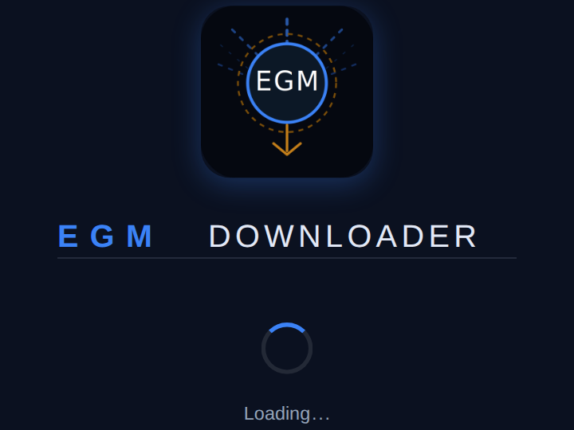
  </a>
  <br/><sub><b>Splash Screen</b></sub>
</div>

<br/>

<table>
  <tr>
    <td align="center" width="50%">
      <a href="screenshots/02-main-ui-yeezus-theme.png">
        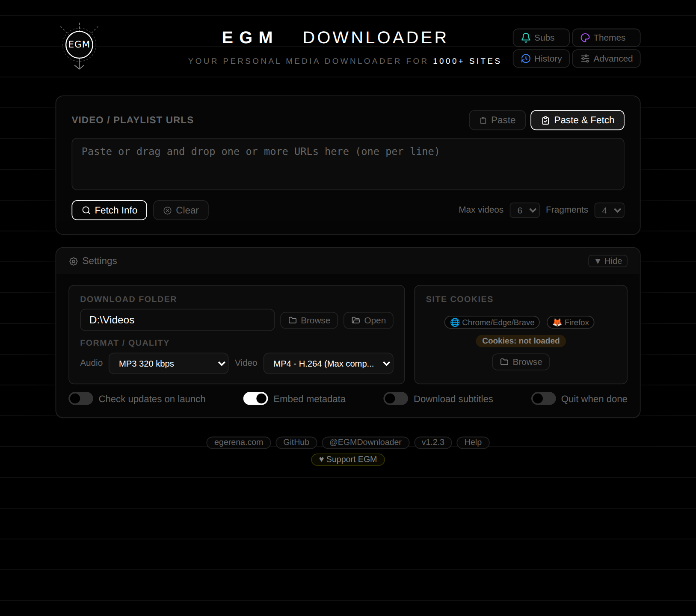
      </a>
      <br/><sub><b>Main UI — Yeezus Theme</b></sub>
    </td>
    <td align="center" width="50%">
      <a href="screenshots/03-advanced-optional-libs-insert-coin-theme.png">
        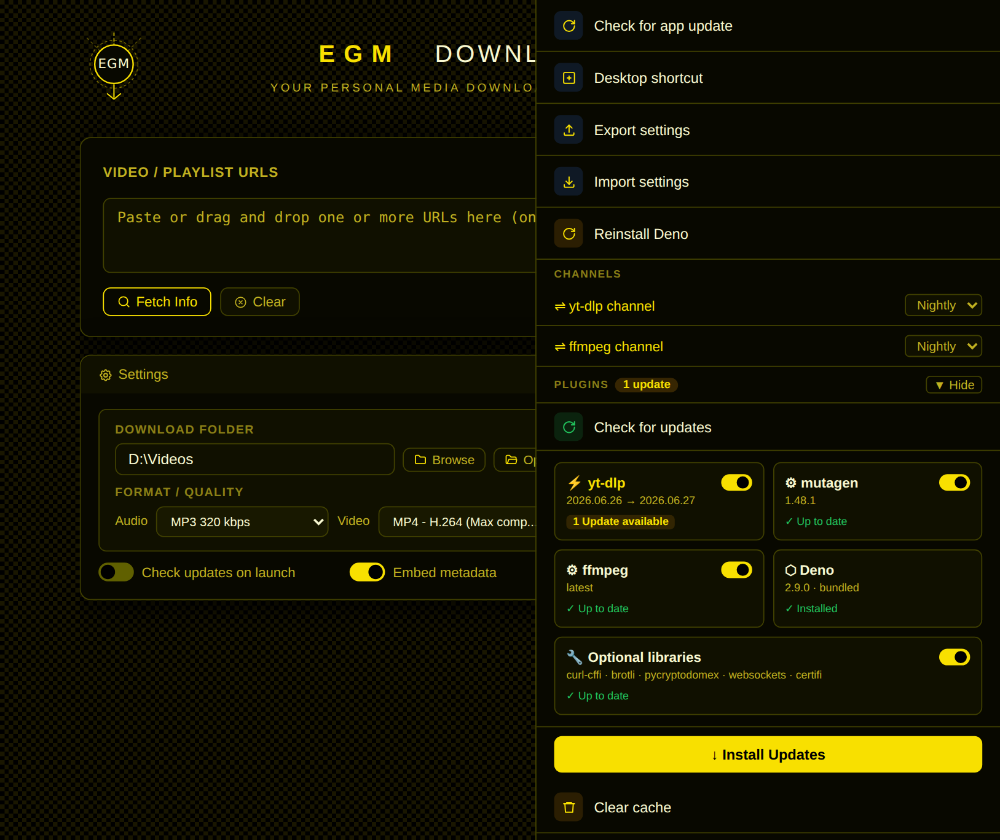
      </a>
      <br/><sub><b>Optional Libraries Panel — Insert Coin Theme</b></sub>
    </td>
  </tr>
  <tr>
    <td align="center">
      <a href="screenshots/04-history-redesigned-odd-cab-theme.png">
        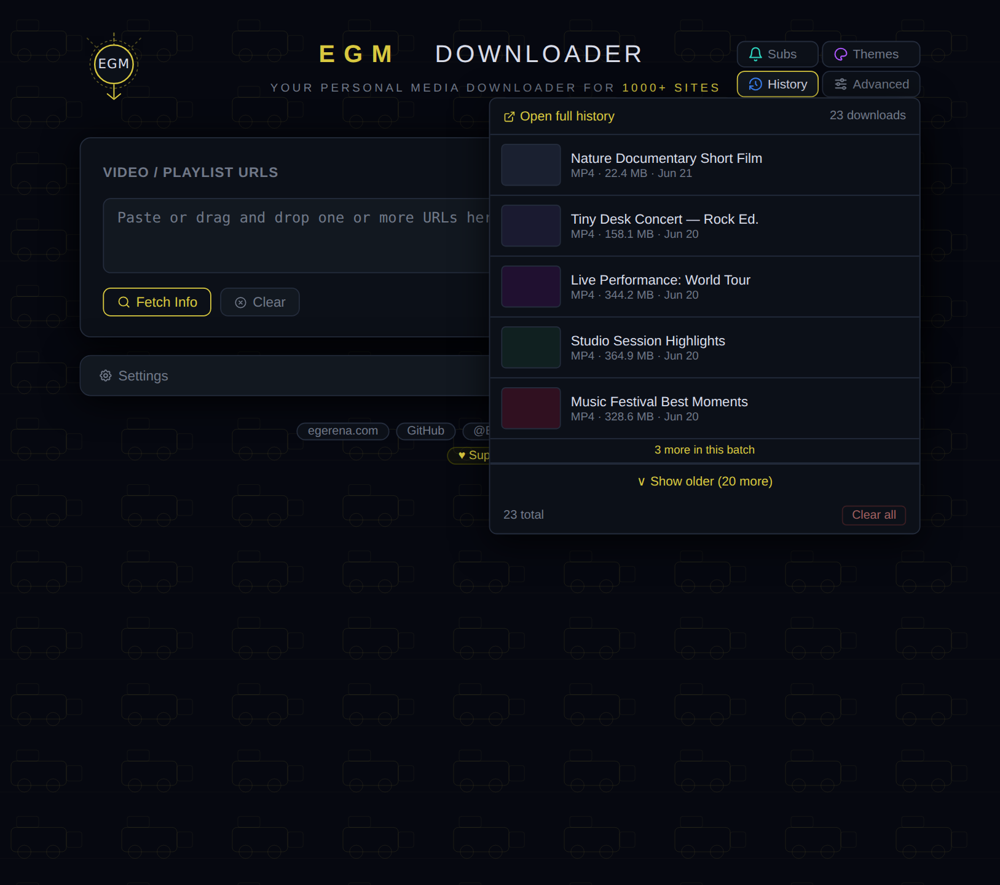
      </a>
      <br/><sub><b>History Redesigned — Odd Cab Theme</b></sub>
    </td>
    <td align="center">
      <a href="screenshots/05-expanded-history-tokyo-neon-theme.png">
        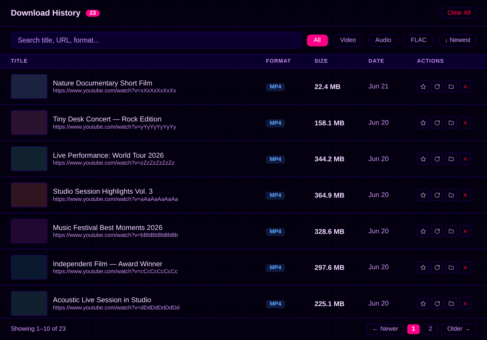
      </a>
      <br/><sub><b>Expanded History — Tokyo Neon Theme</b></sub>
    </td>
  </tr>
  <tr>
    <td align="center">
      <a href="screenshots/06-themes-panel-redesigned-valhalla-theme.png">
        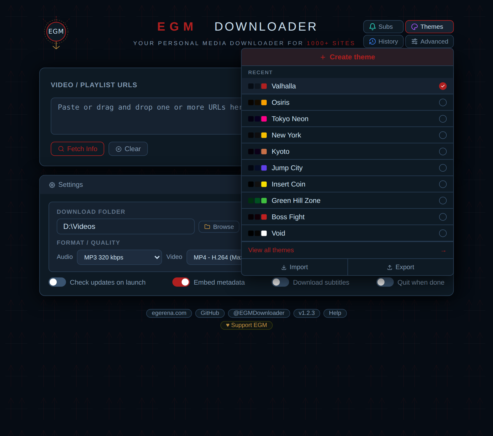
      </a>
      <br/><sub><b>Themes Panel Redesigned — Valhalla Theme</b></sub>
    </td>
    <td align="center">
      <a href="screenshots/07-help-modal-ctrl-k-jump-city-theme.png">
        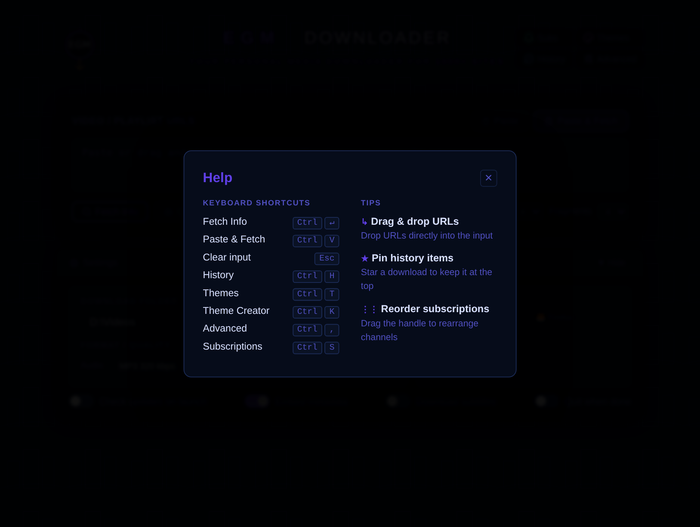
      </a>
      <br/><sub><b>Help Modal — Ctrl+K — Jump City Theme</b></sub>
    </td>
  </tr>
  <tr>
    <td align="center">
      <a href="screenshots/08-theme-creator-prism-theme.png">
        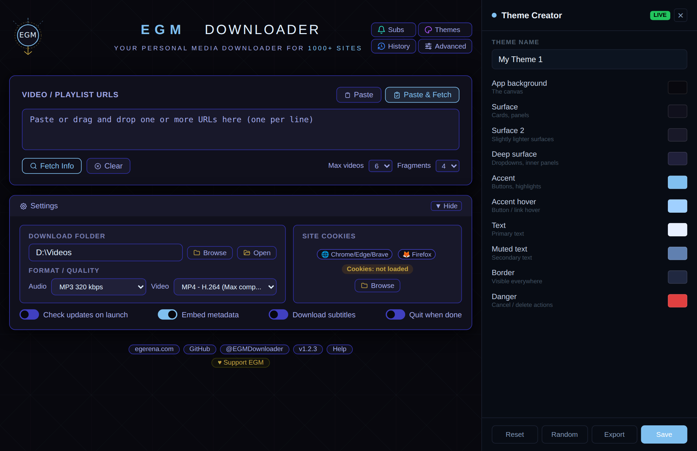
      </a>
      <br/><sub><b>Theme Creator — Prism Theme</b></sub>
    </td>
    <td align="center">
      <a href="screenshots/09-theme-creator-custom-weird-theme.png">
        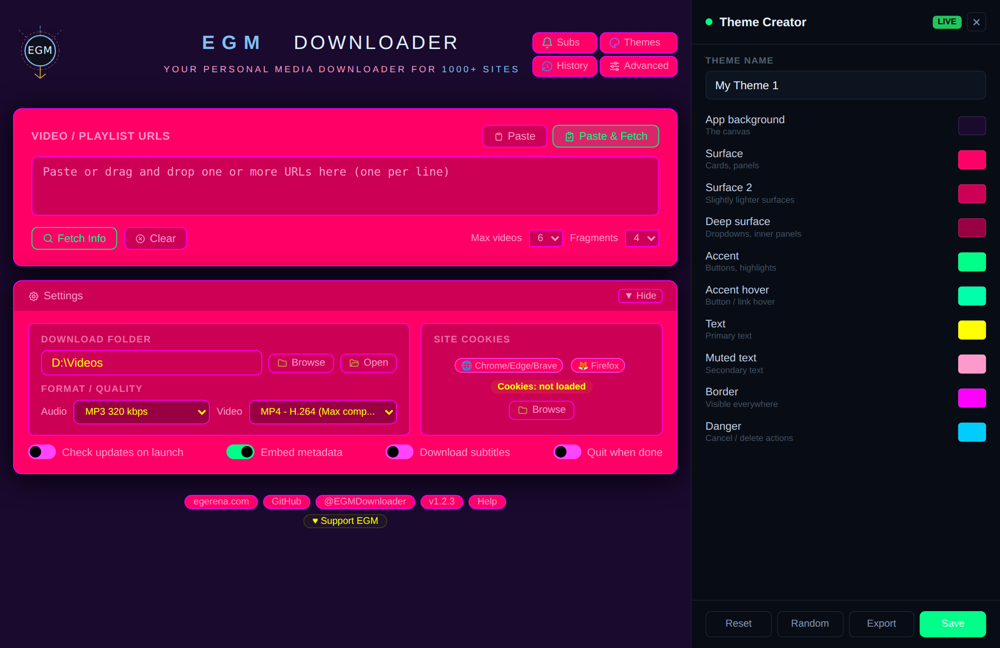
      </a>
      <br/><sub><b>Theme Creator — Custom Theme</b></sub>
    </td>
  </tr>
  <tr>
    <td align="center">
      <a href="screenshots/10-subscriptions-infrared-theme.png">
        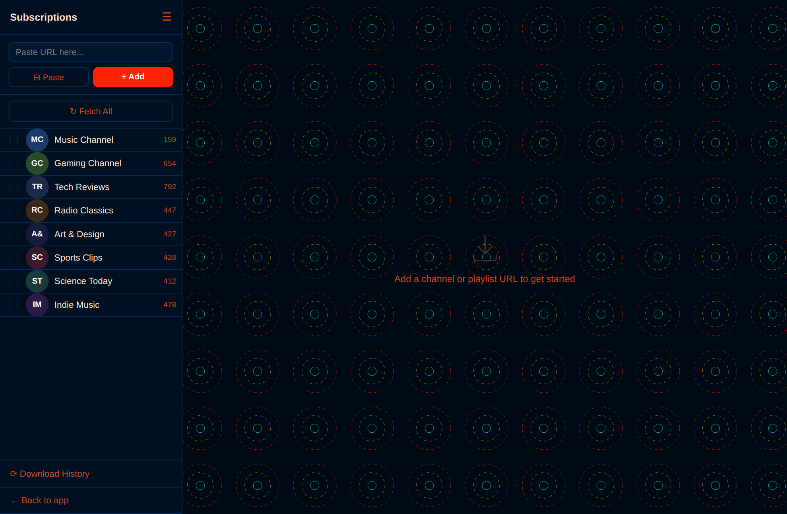
      </a>
      <br/><sub><b>Subscriptions — Infrared Theme</b></sub>
    </td>
    <td align="center">
      <a href="screenshots/11-subscriptions-fetching-corrupted-theme.png">
        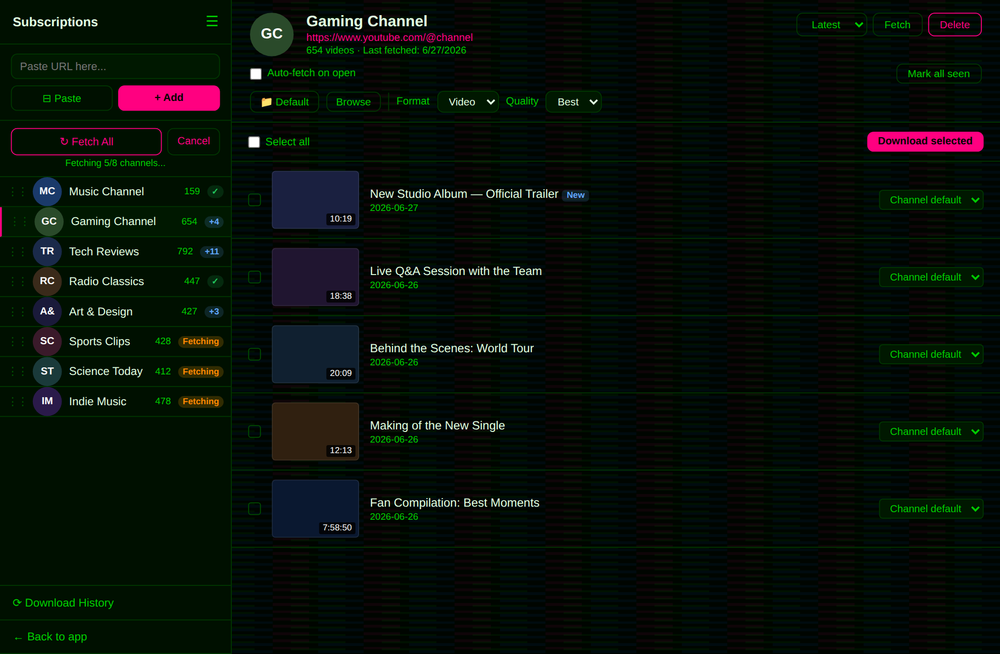
      </a>
      <br/><sub><b>Subscriptions Fetching — Corrupted Theme</b></sub>
    </td>
  </tr>
  <tr>
    <td align="center">
      <a href="screenshots/12-subscriptions-collapsed-beos-theme.png">
        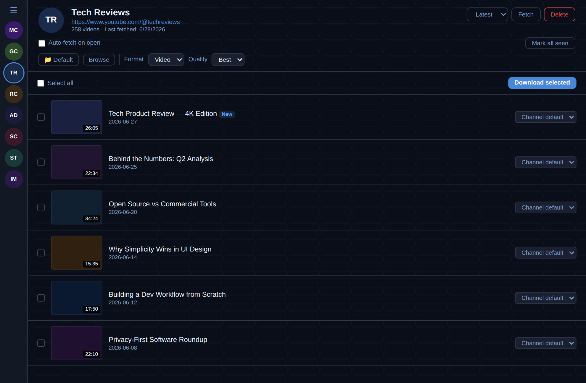
      </a>
      <br/><sub><b>Subscriptions Collapsed — BeOS Theme</b></sub>
    </td>
    <td align="center">
      <a href="screenshots/13-fetching-playlists-new-york-theme.png">
        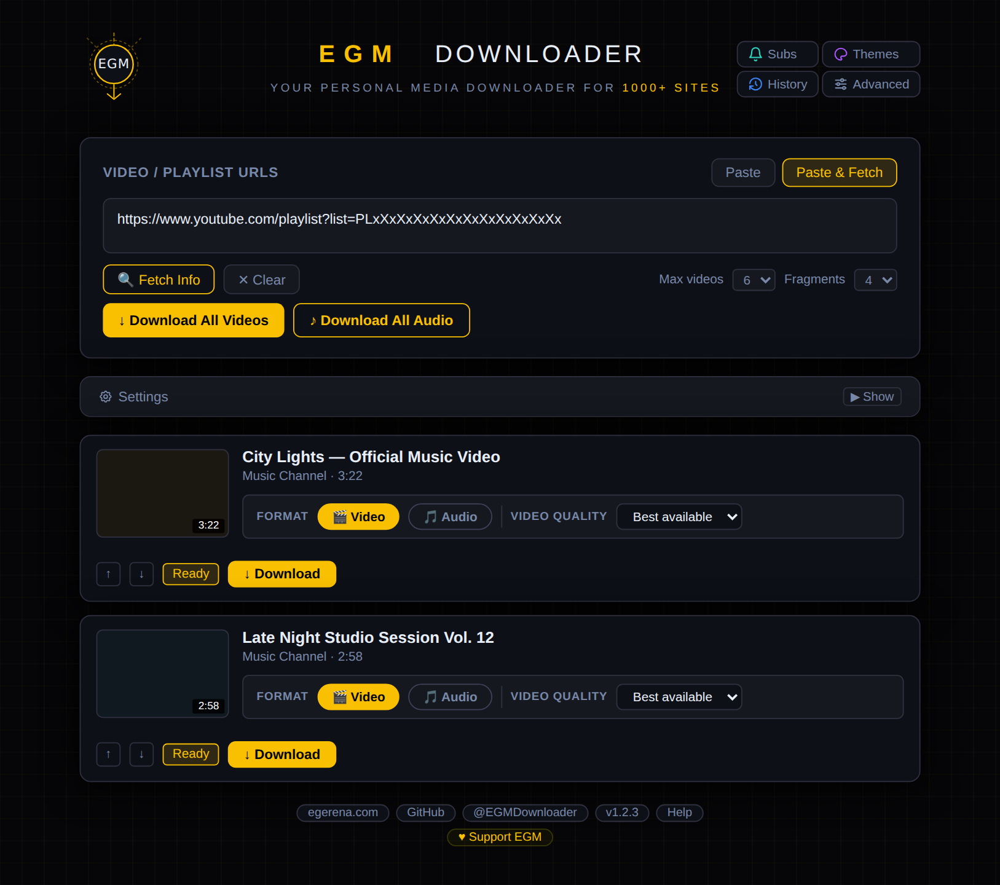
      </a>
      <br/><sub><b>Fetching Playlists — New York Theme</b></sub>
    </td>
  </tr>
</table>

<div align="center">
  <a href="screenshots/14-all-themes-n64-theme.png">
    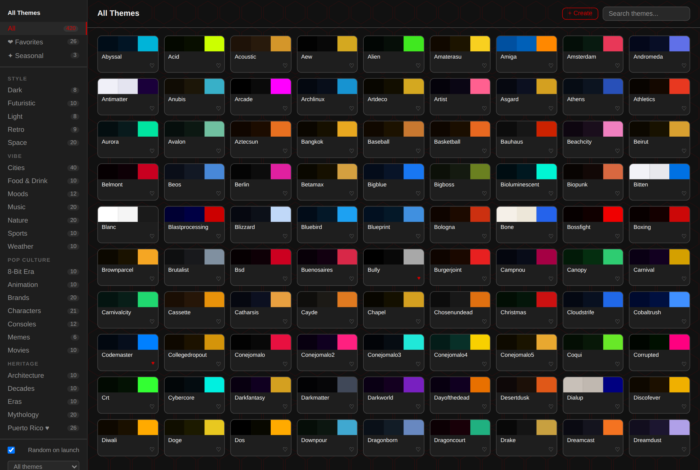
  </a>
  <br/><sub><b>All Themes — N64 Theme</b></sub>
</div>

## 📥 Download

### Windows
**Latest:** v1.2.7 Build 140  
**Download:** [EGMd.zip](https://egerena.com/apps/EGMd.zip) (477 KB · ~800 MB after install)  
**SHA256:** `80ba204b9eaf339b7036caef752efc7d34f4e8e5163344bc7d06d1d35194a074`  
**Requirements:** Windows 10/11 (64-bit) · **Python 3.10+** — install from [python.org](https://www.python.org/downloads/) and tick "Add Python to PATH"  
**Code Signed:** Installer is signed with an IV code signing certificate. SmartScreen may show a warning on first run until the certificate builds reputation.
**Auto-Update:** ✅ Built-in update checker with SHA256 verification

### Windows Portable
**Latest:** v1.2.7 Build 140  
**Download:** [EGMd-portable.zip](https://egerena.com/apps/EGMd-portable.zip) (468 KB · ~800 MB after first run)  
**SHA256:** `998f309758ca199e7f09ba5340edb68ddd19914052d6301d18c0f68f12205619`  
**Requirements:** Windows 10/11 (64-bit) · **Python 3.10+** — install from [python.org](https://www.python.org/downloads/) and tick “Add Python to PATH”  
**No installer, no registry** — runs from any folder or USB drive (system Python 3.10+ is used only to bootstrap; the app then downloads a private embedded Python and runs on that. Node, Electron & ffmpeg are fetched on first run)  
**Code Signed:** Portable is signed with an IV code signing certificate. SmartScreen may show a warning on first run until the certificate builds reputation.
**Auto-Update:** ❌ Manual — check the [releases page](https://github.com/egmtm/EGM-Downloader/releases)

### macOS
**Latest:** v1.2.7 Build 140  
**Download:** [EGMdM.zip](https://egerena.com/apps/EGMdM.zip) (134 MB · ~300 MB after install)  
**SHA256:** `329282aa587617d63d02d429a874719a0f14af19ff1c69c184637c6746985ee8`  
**Requirements:** macOS 11.0 (Big Sur) or later · Apple Silicon (M1–M5) only  
**Signed & Notarized:** This build is Apple notarized — runs without Gatekeeper warnings
**Auto-Update:** ✅ Built-in update checker with SHA256 verification

### Linux
**Latest:** v1.2.7 Build 140  
**Download:** [EGMdL.zip](https://egerena.com/apps/EGMdL.zip) (162 MB · ~300 MB after install)  
**SHA256:** `6c8a3fd09f6e14ce6a7916aee1f872dd02bb173f1c1ce3e3c2fe59194afb0cd7`  
**Format:** AppImage (Universal)  
**Supported Distros:** Ubuntu 20.04+, Mint 20+, Pop!_OS, Fedora 39+, Arch, and more
**Auto-Update:** ❌ Manual — check the [releases page](https://github.com/egmtm/EGM-Downloader/releases)

---

<a id="system-requirements"></a>

### ⚙️ System Requirements

**Windows:** Windows 10/11 (64-bit) · ~800 MB disk space · Internet on first launch

**macOS:** macOS 11.0+ · Apple Silicon (M1–M5) · ~300 MB disk space

**Linux:** 64-bit distribution · ~300 MB disk space · FUSE support
Supported: Ubuntu 20.04/22.04/24.04/26.04, Mint 20/21/22, Pop!_OS 22.04, Zorin 16/17, elementary 7, Debian 11/12, KDE Neon, Fedora 39/40/41, openSUSE Leap 15.5/Tumbleweed, Rocky/AlmaLinux 9, Arch, Manjaro, EndeavourOS
> Ubuntu 22.04+ may require `libfuse2`: `sudo apt install libfuse2`

---

## 🚀 Quick Start

### Windows
1. Extract `EGMd.zip`
2. Run `egm-setup.exe` and follow the installer
3. Paste a video URL, fetch the video info, then click Download!

### Windows Portable
> **Requires [Python 3.10+](https://www.python.org/downloads/)** on your system (tick “Add Python to PATH” during install). Everything else is fetched automatically on first run.

1. Extract `EGMd-portable.zip` to any folder or USB drive
2. Run `EGM Downloader.exe`
3. Paste a video URL, fetch the video info, then click Download!

> Settings and data stay in the same folder — take it anywhere.

### macOS
1. Extract `EGMdM.zip`
2. Open the `.dmg` file
3. Drag "EGM Downloader" to Applications
4. Launch from Applications folder

### Linux
1. Extract `EGMdL.zip`
2. Make executable: `chmod +x "EGM Downloader.AppImage"`
3. Double-click to launch (or run from terminal)

**Windows only — first launch:** The installer downloads runtime components (Node.js, Electron, ffmpeg) once into your user data directory (~250 MB). macOS and Linux bundle these dependencies inside the package — no first-launch download required (which is why their file sizes are larger).

---

## 💡 Usage

1. **Paste URL** - Copy any video URL and paste it into the app, then click "Fetch". You can also use "Paste & Fetch" to paste and fetch in one step.
2. **Select Format** - Choose video (MP4, MP4 H.264, or MKV) or audio (MP3, M4A, OPUS, or FLAC). MP4 H.264 is the default — maximum compatibility everywhere.
3. **Select Quality** - Choose resolution (up to 8K) or audio bitrate
4. **Edit Filename** (Optional) - Click the filename to customize it
5. **Download** - Click the download button and wait for completion
6. **Open Folder** - Click "Open Folder" to view your downloaded files

### Advanced Features

**Playlist Downloads:**
- Paste playlist URL
- Select "Download All" or choose specific videos, then pick your desired resolution. You can also use "Download All Audio" and choose your preferred bitrate.
- Videos and audio downloads are processed in sequence.

**Batch Downloads:**
- Add multiple URLs to the queue
- Select format (MP4/MP3) and quality for each
- Start all queued downloads together
- Cancel individual downloads anytime

**Plugin Updates:**
- Click "Update Plugins" in the Advanced panel
- Update yt-dlp for newest site support
- Update ffmpeg for latest codecs

**Cookies / Login-Required Content:**
- Some sites require browser cookies for premium or age-restricted content
- Import cookies from Chrome, Edge, Brave, or Firefox directly in the app
- Cookies are stored locally on your machine and are never transmitted

**Subscriptions:**
- Subscribe to YouTube channels and playlists — fetch new videos automatically
- Per-channel settings: custom download folder, format, and quality
- Download queue shows all active downloads across all channels

**Theme Creator:**
- Open with Ctrl+K from anywhere in the app
- 10 live-preview color pickers — the UI recolors in real time
- Export as .json or save directly to your library

---

<a id="roadmap"></a>

## 🗺️ Roadmap

**v1.3 — POLYGLOT: FULL THROTTLE:** *(Targeting mid-July 2026)*
- 🌍 In-app language picker — 10 languages: English, Arabic, German, Spanish, French, Italian, Japanese, Dutch, Portuguese, Russian
- Auto-detects your system language on first launch; change anytime from the footer, no restart needed
- Language selector and Settings panel (incl. Site Cookies) can each be hidden from Advanced settings for a cleaner footer, and re-enabled anytime
- Downloaded subtitles now include your selected app language alongside English (when available)
- Windows installer redesigned to match the app's dark theme, with language selection at setup
- 🎨 50 new themes — 500 total (categories TBD, more details coming soon)
- ✨ New opt-in **Upscale to selected quality** — videos smaller than the chosen quality preset are proportionally upscaled to it after download (off by default; adds pixels, not detail) — requested by @ligun0510!
- Video conversion (H.264 compatibility format and Upscale) now uses your GPU when available — cuts CPU load and heat dramatically, with automatic fallback to software encoding
- The "Converting…" status now shows which encoder is active (e.g. "Converting… · h264_nvenc") so you can confirm hardware acceleration is working
- Fixed Cancel being silently ignored during video conversion — clicking Cancel now actually stops it instead of letting it run to completion
- ✨ New HDR downloads — videos with an HDR version (HDR10, HDR10+, HLG, Dolby Vision) now show as a separate option per resolution; saves as MKV to preserve HDR data untouched (requires an HDR-capable display and player)
- Fixed Full HD/4K downloads sometimes grabbing a smaller video than "Best available" on portrait video (TikTok, Shorts, Reels) — thank you @ligun0510!
- Subscriptions now detects and labels members-only videos (latest yt-dlp stable/nightly required)
- Mac and Linux can now update optional libraries (curl-cffi, brotli, pycryptodomex, websockets, certifi) in-app — previously view-only
- Subscriptions download queue now stays pinned at the top of the sidebar instead of scrolling out of view with a long channel list
- Deno now updates alongside yt-dlp, ffmpeg, and other plugins instead of its own separate button
- Advanced panel shows current → latest version for optional libraries and ffmpeg when an update is available
- Fixed cancelling a video conversion (H.264 fix-up or Upscale) on Mac/Linux sometimes closing the whole app instead of just that download
- Mac DMG install window refreshed with a custom background matching the app's theme
- Deleting a custom theme now asks for confirmation first — previously deleted instantly with no way to undo
- Removed the "Clear cache" button from Advanced settings — cleanup already happens automatically after every download and on launch
- Windows Advanced panel tidied up — buttons now sit two-to-a-row instead of stacked
- Fixed the Windows taskbar right-click menu showing "Electron" instead of "EGM Downloader"
- Minor polish — Subscriptions sidebar thumbnail spacing, Update/What's New modal scrollbar spacing, more compact Site Cookies panel

**v1.4 and beyond:**
- 🧩 *Browser extension — send URLs straight to EGM Downloader without leaving your browser. Revisiting when the userbase is stronger.*

**See:** [GitHub Issues](https://github.com/egmtm/EGM-Downloader/issues) for details and progress.

---

## 📖 The Origin Story

EGM Downloader was born from inspiration and a desire to make video downloading accessible to everyone.

**The inspiration:** [ReClip](https://github.com/averygan/reclip) by [@averygan](https://github.com/averygan) beautifully demonstrated what's possible with yt-dlp and a clean web interface.

**The challenge:** ReClip's self-hosted approach is perfect for developers, but I wanted to share this with friends and family who don't use the terminal. Setting up Python, yt-dlp, ffmpeg, and Flask isn't everyone's cup of tea.

**The solution:** What if you could just download an app and go? No terminal. No dependencies. No setup. Just double-click and start downloading.

That's EGM Downloader—native desktop apps for Windows, macOS, and Linux with professional installers, auto-updates, and zero technical knowledge required.

We've taken the concept in a different direction (native apps vs. web-based, end-users vs. developers), but the core inspiration came from ReClip's elegant simplicity.

**Big thanks to [@averygan](https://github.com/averygan) for ReClip—you sparked the idea that became this project!** 🙏

**This is my first major project, and I'm excited to keep learning and building more tools that make technology accessible to everyone.** 🚀

---

## ⚖️ Legal & Responsible Use

EGM Downloader is a tool for downloading video content from the internet. While the software itself is legal, **you are responsible for how you use it.**

### Legitimate Uses

This tool is designed for lawful purposes, including:
- Downloading your own content
- Downloading Creative Commons or public domain content
- Fair use purposes (education, research, criticism, commentary)
- Archiving content you have permission to download
- Backing up content you own or have rights to
- Offline viewing in jurisdictions where personal downloading is legal

### Your Responsibilities

When using this tool, you must:
- **Respect copyright laws** - Only download content you have the right to download
- **Follow Terms of Service** - Many platforms prohibit downloading; check their policies
- **Obtain permission** - When required by law or platform rules
- **Use responsibly** - Do not redistribute, sell, or commercially exploit downloaded content without proper rights

### Disclaimer

**This tool is provided "as-is" for personal, lawful use only.**

The developers:
- Do not encourage or condone copyright infringement
- Are not responsible for how users choose to use this software
- Do not provide legal advice regarding what you can or cannot download
- Assume no liability for user actions or violations of third-party terms

**You are solely responsible for ensuring your use complies with applicable laws, regulations, and terms of service.**

If you're unsure whether your use case is legal, consult a legal professional in your jurisdiction.

---

## 🛠️ For Developers

### Repository Structure

```
EGM-Downloader/
│
├── app.py                          ← Flask backend         [shared — all platforms]
├── templates/                      ← UI templates          [shared — Windows + Mac]
│   ├── index.html                  ← Main UI shell
│   ├── subscriptions.html          ← Subscriptions window
│   ├── history.html                ← Download history
│   ├── themes.html                 ← Theme picker
│   ├── theme_data.html             ← THEME_DATA + THEMES array
│   ├── theme_validator.html        ← Shared CSS variable validation gate
│   ├── theme_styles.html           ← Theme CSS definitions
│   └── js/                         ← Extracted JS partials
├── static/                         ← App icons             [shared — all platforms]
├── languages/                      ← i18n language files   [shared — all platforms]
│
├── windows/                        ← Windows platform files
├── mac/                            ← macOS platform files
├── linux/                          ← Linux platform files
├── scripts/                        ← Build automation
└── tests/                          ← Automated test suite
```

See [CONTRIBUTING.md](CONTRIBUTING.md) for the complete build guide, version management workflow, and CI details.

---

## 🏗️ Built With

EGM Downloader is powered by incredible open source projects:

- **[yt-dlp](https://github.com/yt-dlp/yt-dlp)** - Download engine (1000+ sites)
- **[bgutil-ytdlp-pot-provider](https://github.com/Brainicism/bgutil-ytdlp-pot-provider)** - YouTube PO Token generation (proof-of-origin)
- **[yt-dlp/ejs](https://github.com/yt-dlp/ejs)** - EJS remote components for YouTube signature solving
- **[curl_cffi](https://github.com/lexiforest/curl_cffi)** - Browser TLS impersonation for yt-dlp — enables downloads from sites that fingerprint HTTP clients
- **[Flask](https://flask.palletsprojects.com/)** - Web framework
- **[Electron](https://www.electronjs.org/)** - Cross-platform desktop wrapper
- **[FFmpeg](https://ffmpeg.org/)** - Video/audio processing
- **[Deno](https://deno.com/)** - JavaScript runtime for YouTube tokens
- **[mutagen](https://mutagen.readthedocs.io/)** - Audio metadata tagging (thumbnail, chapters, title/artist/date)

See [CREDITS.md](CREDITS.md) for complete acknowledgments and licenses.

---

## 🐛 Troubleshooting

**Windows — app won't start:** Make sure [Python 3.10+](https://www.python.org/downloads/) is installed and on PATH · check the `logs/` folder · for detailed errors, open a command prompt in the app folder and run `python launch.py`

**macOS — download stuck:** Update plugins → restart the app → check Console.app for errors

**Linux — AppImage won't launch:**
- Ensure executable: `chmod +x "EGM Downloader.AppImage"`
- Install FUSE: `sudo apt install libfuse2` (Ubuntu/Debian)
- Run from terminal to see errors

**Need more help?** [Open an issue on GitHub](https://github.com/egmtm/EGM-Downloader/issues)

---

## 📜 License

This project is licensed under the **GNU Affero General Public License v3.0 (AGPL-3.0)** — see the [LICENSE](LICENSE) file for details.

- ✅ Free to use, modify, and distribute under AGPL-3.0 terms
- ✅ Modification and distribution allowed (must share modifications + source)
- ⚠️ Network use triggers copyleft

---

## 📞 Support & Security

- 🐛 **Bug Reports / Feature Requests:** [Open an Issue](https://github.com/egmtm/EGM-Downloader/issues)
- 🐦 **Updates & Announcements:** [@EGMDownloader](https://x.com/EGMDownloader) on X
- 📖 **Contributing:** [Read CONTRIBUTING.md](CONTRIBUTING.md)
- 🔒 **Security Vulnerabilities:** Do not open a public issue — email contact@egerena.com or use [GitHub's private vulnerability reporting](https://github.com/egmtm/EGM-Downloader/security/advisories/new). We aim to respond within 48 hours.
