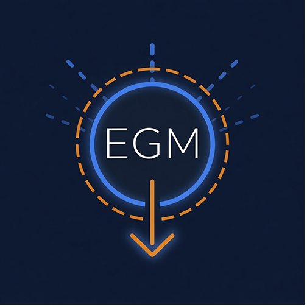
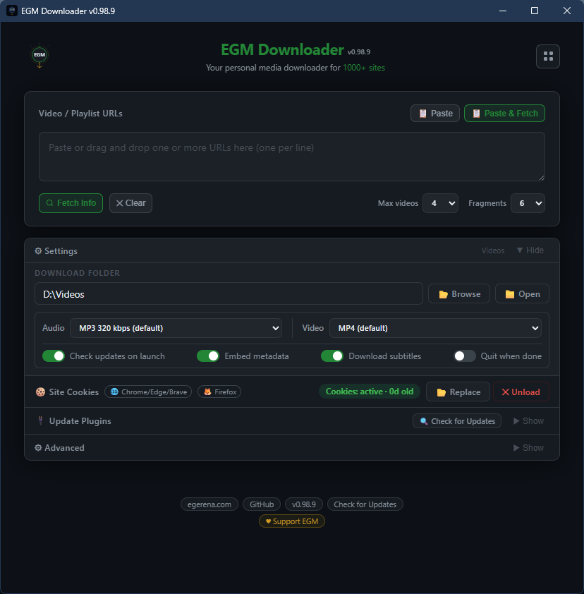
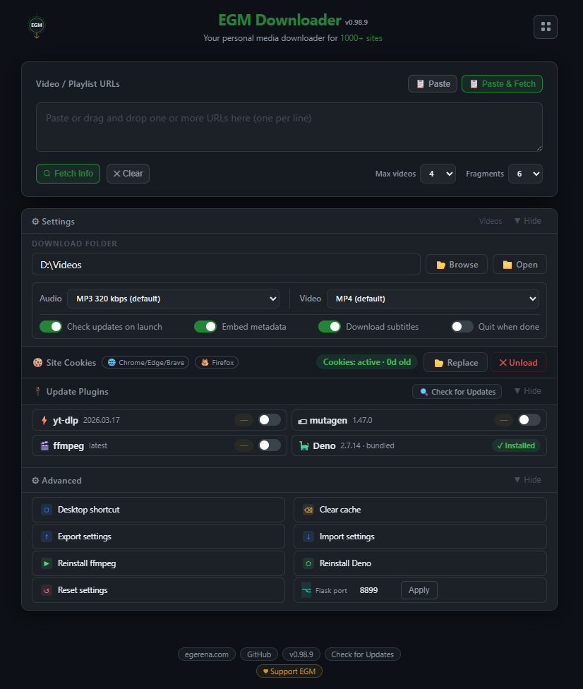
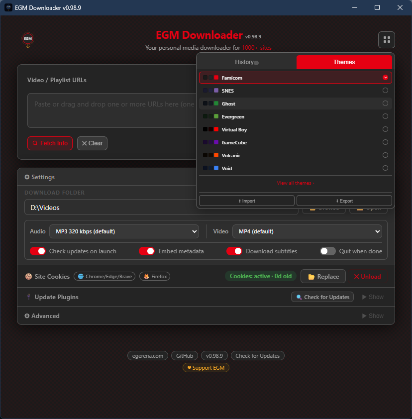
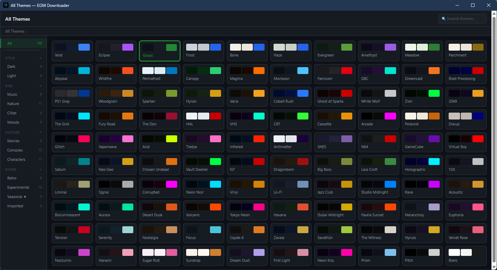
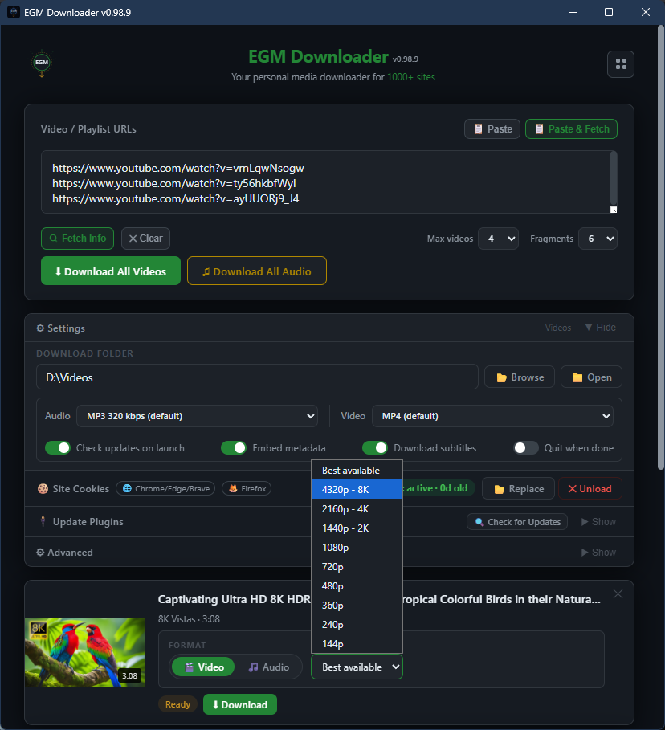
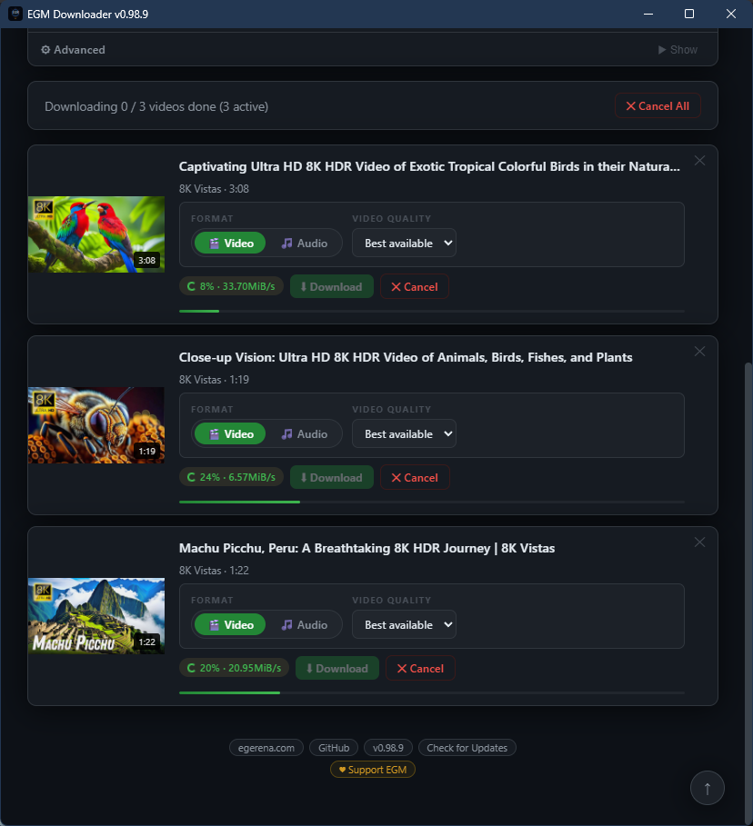
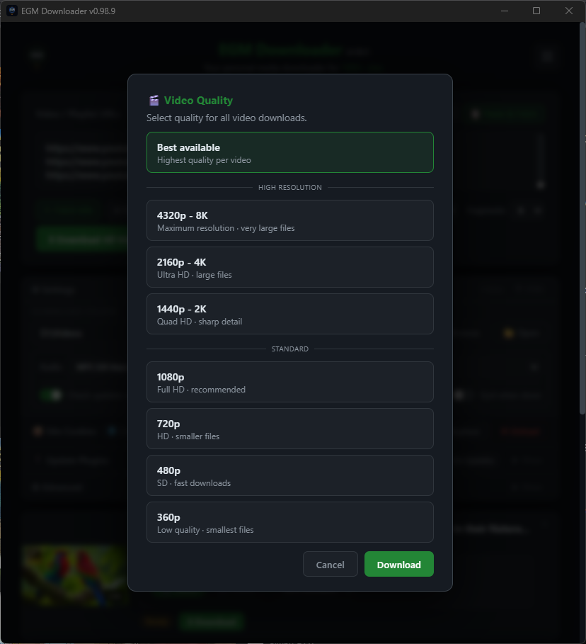
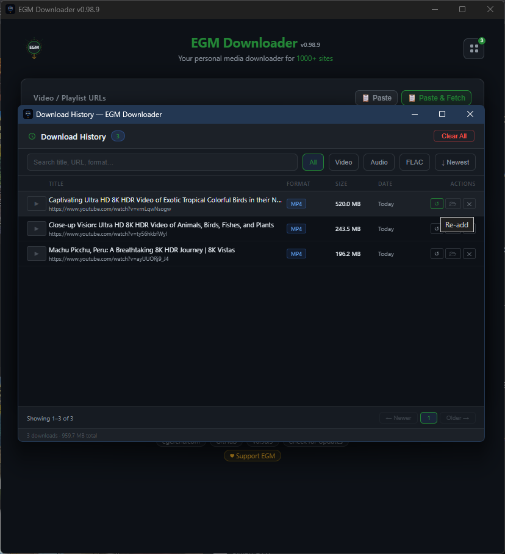
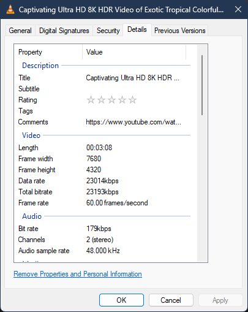

<div align="center">
  
  
  <h1>EGM Downloader</h1>
  
  <p>
    
    
    
    
    <a href="https://www.gnu.org/licenses/agpl-3.0"></a>
    
    
    
    
    
    
    
    
    
  </p>

  <p><strong>A powerful, multi-platform video and audio downloader for 1000+ websites.</strong></p>
  
  <p>Download videos or extract audio from YouTube, TikTok, Instagram, Twitter, Facebook, and hundreds of other platforms with a beautiful, easy-to-use interface.</p>
  <p><em>Powered by yt-dlp · runs locally · no telemetry · no accounts</em></p>
</div>

---

<p align="center"><a href="#-download">⬇ Jump to Downloads</a></p>

## ✨ Features

- 🌐 **1000+ Supported Sites** - Download from YouTube, TikTok, Instagram, Twitter, Vimeo, and more
- 🎬 **Video & Audio Downloads** - MP4 or MKV video; MP3, M4A, OPUS, or FLAC audio
- 📊 **Quality Selection** - Video up to 8K/4K/2K/1080p; audio up to FLAC or 320 kbps MP3
- 📋 **Playlist Support** - Download entire playlists with one click
- ⚡ **Batch Downloads** - Queue multiple URLs and download them all at once
- 🖱️ **Drag & Drop + Keyboard Shortcuts** - Drop URLs directly into the app; Ctrl+V / ⌘V fetches, Ctrl+Enter / ⌘Return starts, Esc clears
- 🎨 **120 Themes** - 110 permanent across 10 categories + 10 seasonal easter eggs with smooth transitions
- 📜 **Download History** - Track all downloads with search, filter, and re-download capability
- 🔤 **Subtitles & Metadata** - Embed subtitles and rich metadata (thumbnail, chapters, title/artist/date) directly into video files
- 🔄 **Auto-Updates** - Built-in update checker with SHA256 checksum verification (Windows/Mac)
- 📝 **Custom Filenames** - Edit filenames before downloading
- 🛠️ **Plugin Updates** - Update yt-dlp and ffmpeg without reinstalling
- 🧹 **Smart Cleanup** - Automatic removal of temporary files and failed downloads
- 💼 **Windows Portable** - Run from any folder or USB drive — no installer, no registry
- 🖥️ **Cross-Platform** - Native apps for Windows, macOS, and Linux

---

## ⚖️ Legal & Responsible Use

EGM Downloader is a tool for downloading video content from the internet. While the software itself is legal, **you are responsible for how you use it.**

### Legitimate Uses

This tool is designed for lawful purposes, including:
- Downloading your own content
- Downloading Creative Commons or public domain content
- Fair use purposes (education, research, criticism, commentary)
- Archiving content you have permission to download
- Backing up content you own or have rights to
- Offline viewing in jurisdictions where personal downloading is legal

### Your Responsibilities

When using this tool, you must:
- **Respect copyright laws** - Only download content you have the right to download
- **Follow Terms of Service** - Many platforms prohibit downloading; check their policies
- **Obtain permission** - When required by law or platform rules
- **Use responsibly** - Do not redistribute, sell, or commercially exploit downloaded content without proper rights

### Disclaimer

**This tool is provided "as-is" for personal, lawful use only.**

The developers:
- Do not encourage or condone copyright infringement
- Are not responsible for how users choose to use this software
- Do not provide legal advice regarding what you can or cannot download
- Assume no liability for user actions or violations of third-party terms

**You are solely responsible for ensuring your use complies with applicable laws, regulations, and terms of service.**

If you're unsure whether your use case is legal, consult a legal professional in your jurisdiction.

---

## 💡 The Origin Story

EGM Downloader was born from inspiration and a desire to make video downloading accessible to everyone.

**The inspiration:** [ReClip](https://github.com/averygan/reclip) by [@averygan](https://github.com/averygan) beautifully demonstrated what's possible with yt-dlp and a clean web interface.

**The challenge:** ReClip's self-hosted approach is perfect for developers, but I wanted to share this with friends and family who don't use the terminal. Setting up Python, yt-dlp, ffmpeg, and Flask isn't everyone's cup of tea.

**The solution:** What if you could just download an app and go? No terminal. No dependencies. No setup. Just double-click and start downloading.

That's EGM Downloader—native desktop apps for Windows, macOS, and Linux with professional installers, auto-updates, and zero technical knowledge required.

We've taken the concept in a different direction (native apps vs. web-based, end-users vs. developers), but the core inspiration came from ReClip's elegant simplicity.

**Big thanks to [@averygan](https://github.com/averygan) for ReClip—you sparked the idea that became this project!** 🙏

**This is my first major project, and I'm excited to keep learning and building more tools that make technology accessible to everyone.** 🚀

---

## 📥 Download

### Windows
**Latest:** v0.98.10 Build 107  
**Download:** [EGMd.zip](https://egerena.com/apps/EGMd.zip) (316 KB · ~800 MB after install)  
**SHA256:** `400386d7b9533b2f25e3d976137b61f4870c6f6dd54035352bb2fbbd696ff47c`  
**Requirements:** Windows 10/11 (64-bit)  
**Code Signed:** Installer is signed with an IV certificate (SSL.com) — no SmartScreen warnings

### Windows Portable
**Latest:** v0.98.10 Build 107  
**Download:** [EGMd-portable.zip](https://egerena.com/apps/EGMd-portable.zip) (268 KB · ~800 MB after first run)  
**SHA256:** `6bd8eb9ad0a660b0b23b4cec1df1b7be931a2d9fd48cbc04d2b4e12d26ab7090`  
**Requirements:** Windows 10/11 (64-bit)  
**No installer, no registry** — runs from any folder or USB drive

### macOS
**Latest:** v0.98.10 Build 107  
**Download:** [EGMdM.zip](https://egerena.com/apps/EGMdM.zip) (109 MB · ~300 MB after install)  
**SHA256:** `ddd3686c0280dc2c1a82e783ab08a64bf36ee827256a959d433c5de7c2ab2fbf`  
**Requirements:** macOS 11.0 (Big Sur) or later · Apple Silicon (M1–M5) only
**Signed & Notarized:** This build is Apple notarized — runs without Gatekeeper warnings

### Linux
**Latest:** v0.98.10 Build 107  
**Download:** [EGMdL.zip](https://egerena.com/apps/EGMdL.zip) (120 MB · ~300 MB after install)  
**SHA256:** `69a81925c4e6c9483a0f9bcd7ce11b56fb8f719641b85d393f3663f453d3691c`  
**Format:** AppImage (Universal)  
**Supported Distros:** Ubuntu 20.04+, Mint 20+, Pop!_OS, Fedora 39+, Arch, and more

> **Note:** Distributions available on [egerena.com](https://egerena.com)

---

## 🚀 Quick Start

### Windows
1. Extract `EGMd.zip`
2. Run `egm-setup.exe` and follow the installer
3. Paste a video URL and click Download!

### Windows Portable
1. Extract `EGMd-portable.zip` to any folder or USB drive
2. Run `EGM Downloader.vbs`
3. Paste a video URL and click Download!

> Settings and data stay in the same folder — take it anywhere.

### macOS
1. Extract `EGMdM.zip`
2. Open the `.dmg` file
3. Drag "EGM Downloader" to Applications
4. Launch from Applications folder

### Linux
1. Extract `EGMdL.zip`
2. Make executable: `chmod +x "EGM Downloader.AppImage"`
3. Double-click to launch (or run from terminal)

**Linux only — first launch:** The AppImage downloads runtime components (Node.js, Electron, ffmpeg) once into your user data directory. Windows and macOS bundle these dependencies — no first-launch download required.

---

## 💡 Usage

1. **Paste URL** - Copy any video URL and paste it into the app
2. **Select Format** - Choose video (MP4 or MKV) or audio (MP3, M4A, OPUS, or FLAC)
3. **Select Quality** - Choose resolution (up to 8K) or audio bitrate
4. **Edit Filename** (Optional) - Click the filename to customize it
5. **Download** - Click the download button and wait for completion
6. **Open Folder** - Click "Open Folder" to view your downloaded files

### Advanced Features

**Playlist Downloads:**
- Paste playlist URL
- Select "Download All" or choose specific videos
- Videos download in sequence

**Batch Downloads:**
- Add multiple URLs to the queue
- Select format (MP4/MP3) and quality for each
- Download all at once
- Cancel individual downloads anytime

**Plugin Updates:**
- Click "Update Plugins" in settings
- Update yt-dlp for newest site support
- Update ffmpeg for latest codecs

**Cookies / Login-Required Content:**
- Some sites require browser cookies for premium or age-restricted content
- Import cookies from Chrome, Edge, Brave, or Firefox directly in the app
- Cookies are stored locally on your machine and are never transmitted

---

## 🖼️ Screenshots

> 📸 *Screenshots captured on v0.98.9 "Fit & Finish". As EGM Downloader evolves, new screenshots and video walkthroughs will be added with each release.*

<table>
  <tr>
    <td align="center" width="50%">
      <a href="screenshots/main-ui-ghost-theme.png">
        
      </a>
      <br/><sub><b>Main UI — Ghost Theme</b></sub>
    </td>
    <td align="center" width="50%">
      <a href="screenshots/main-ui-expanded.png">
        
      </a>
      <br/><sub><b>Main UI — Expanded</b></sub>
    </td>
  </tr>
  <tr>
    <td align="center">
      <a href="screenshots/theme-switcher-famicom.png">
        
      </a>
      <br/><sub><b>Theme Switcher — Famicom Theme</b></sub>
    </td>
    <td align="center">
      <a href="screenshots/themes-window.png">
        
      </a>
      <br/><sub><b>Themes Window</b></sub>
    </td>
  </tr>
  <tr>
    <td align="center">
      <a href="screenshots/video-quality-selector.png">
        
      </a>
      <br/><sub><b>Video Quality Selector</b></sub>
    </td>
    <td align="center">
      <a href="screenshots/downloading-videos.png">
        
      </a>
      <br/><sub><b>Fetched Videos — Downloading</b></sub>
    </td>
  </tr>
  <tr>
    <td align="center">
      <a href="screenshots/batch-download-quality-picker.png">
        
      </a>
      <br/><sub><b>Batch Download Quality Picker</b></sub>
    </td>
    <td align="center">
      <a href="screenshots/download-history-expanded.png">
        
      </a>
      <br/><sub><b>Download History — Expanded</b></sub>
    </td>
  </tr>
  <tr>
    <td align="center" colspan="2">
      <a href="screenshots/video-output.png">
        
      </a>
      <br/><sub><b>Video Output</b></sub>
    </td>
  </tr>
</table>

---

## 🛠️ For Developers

### Repository Structure

```
EGM-Downloader/
│
├── app.py                          ← Flask backend         [shared — all platforms]
├── templates/                      ← UI templates          [shared — Windows + Mac]
│   ├── index.html                  ← Main UI
│   ├── history.html                ← Version history
│   ├── themes.html                 ← Theme picker
│   └── theme_styles.html           ← Theme CSS definitions
├── static/                         ← App icons             [shared — all platforms]
├── languages/                      ← i18n language files   [shared — all platforms]
│   └── en.json, es.json, fr.json, pt.json, de.json, it.json, ...
│
├── windows/                        ← Windows platform files
├── mac/                            ← macOS platform files
├── linux/                          ← Linux platform files
├── scripts/                        ← Build automation
│   ├── bump-version.py             ← Version management
│   ├── validate-version-sync.py    ← Version sync validator (CI)
│   ├── gen-update-json.py          ← Update JSON generation
│   └── add-patchnote.py            ← Changelog management
│
├── version.json                    ← Single source of truth
├── requirements.txt                ← Python dependencies
└── patchnotes.txt                  ← Version history
```

### Build Workflow

**1. Bump version:**
```bash
python scripts/bump-version.py
# Or bump version string:
python scripts/bump-version.py --version 0.92
```

**2. Add patch notes:**
```bash
python scripts/add-patchnote.py "Fixed bug" "Added feature"
```

**3. Generate update JSONs:**
```bash
python scripts/gen-update-json.py --notes "Fixed X; Added Y"
```

See [CONTRIBUTING.md](CONTRIBUTING.md) for complete development guide.

### Build Artifacts

EGM Downloader desktop app build artifacts (`EGMd.zip`, `EGMdM.zip`, `EGMdL.zip`, `EGMd-portable.zip`) and their JSON update feeds (`egm-version.json`, `egmac-update.json`, `egmlinux-update.json`, `egm-portable-version.json`) are uploaded to the server manually by EGM after each release build. They are **NOT** in this repo and **NOT** touched by the auto-deploy pipeline.

---

## 🤝 Contributing

We welcome contributions! Whether it's:
- 🐛 Bug reports
- 💡 Feature requests
- 📝 Documentation improvements
- 🔧 Code contributions

**Get started:**
1. Read [CONTRIBUTING.md](CONTRIBUTING.md)
2. Fork the repository
3. Create a feature branch
4. Make your changes
5. Submit a pull request

**Code Quality:**
- ✅ Python linting (flake8, isort)
- ✅ JavaScript linting (ESLint)
- ✅ Version sync validation
- ✅ Automated quality checks

All pull requests are automatically tested via GitHub Actions.

---

## 📊 Platform Status

| Platform | Status | Build | Distribution | Auto-Update |
|----------|--------|-------|--------------|-------------|
| Windows (Installer) | ✅ Live | Build 107 | EGMd.zip | ✅ Yes |
| Windows (Portable)  | ✅ Live | Build 107 | EGMd-portable.zip | ❌ Manual |
| macOS    | ✅ Live | Build 107 | EGMdM.zip | ✅ Yes |
| Linux    | ✅ Live | Build 107 | EGMdL.zip | ❌ Manual |

**All platforms are production-ready and actively maintained.**

---

## 🏗️ Built With

EGM Downloader is powered by incredible open source projects:

- **[yt-dlp](https://github.com/yt-dlp/yt-dlp)** - Download engine (1000+ sites)
- **[bgutil-ytdlp-pot-provider](https://github.com/Brainicism/bgutil-ytdlp-pot-provider)** - YouTube PO Token generation (proof-of-origin)
- **[Flask](https://flask.palletsprojects.com/)** - Web framework
- **[Electron](https://www.electronjs.org/)** - Cross-platform desktop wrapper
- **[FFmpeg](https://ffmpeg.org/)** - Video/audio processing
- **[Deno](https://deno.com/)** - JavaScript runtime for YouTube tokens
- **[mutagen](https://mutagen.readthedocs.io/)** - Audio metadata tagging (thumbnail, chapters, title/artist/date)

See [CREDITS.md](CREDITS.md) for complete acknowledgments and licenses.

---

## 🔄 Version Management

`version.json` is the single source of truth. Never edit version numbers manually — always use:

```bash
python scripts/bump-version.py
```

This ensures all platform files stay synchronized.

---

## 🧪 Continuous Integration

Automated quality checks run on every push and pull request:

- **Version Sync Validation** - Prevents version drift across platforms
- **Python Linting** - Code quality (flake8, isort)
- **JavaScript Linting** - Frontend quality (ESLint)
- **First Contributor Welcome** - Automated onboarding

View workflows: [GitHub Actions](https://github.com/egmtm/EGM-Downloader/actions)

---

## 📋 System Requirements

### Windows
- Windows 10 (64-bit) or Windows 11
- 200 MB free disk space
- Internet connection (first launch only)

### macOS
- macOS 11.0 (Big Sur) or later
- Apple Silicon (M1/M2/M3/M4/M5)
- 250 MB free disk space
- Internet connection (first launch only)

### Linux
- 64-bit distribution (see supported list below)
- 300 MB free disk space
- FUSE support (pre-installed on most distros)
- Internet connection (first launch only)

**Supported Linux Distributions:**
Ubuntu 20.04/22.04/24.04, Mint 20/21/22, Pop!_OS 22.04, Zorin 16/17, elementary 7, Debian 11/12, KDE Neon, Fedora 39/40/41, openSUSE Leap 15.5/Tumbleweed, Rocky/AlmaLinux 9, Arch, Manjaro, EndeavourOS

> Ubuntu 22.04+ may require `libfuse2`: `sudo apt install libfuse2`

---

## 🐛 Troubleshooting

### Windows
**App won't start:**
- Run `launch.bat` to see error messages
- Check `logs/` folder for details

**Download fails:**
- Update yt-dlp via "Update Plugins"
- Check internet connection
- Try different quality/format

### macOS
**Download stuck:**
- Update plugins
- Restart the app
- Check Console.app for errors

### Linux
**AppImage won't launch:**
- Ensure executable: `chmod +x "EGM Downloader.AppImage"`
- Install FUSE: `sudo apt install libfuse2` (Ubuntu/Debian)
- Run from terminal to see errors

**Need more help?** Open an issue on GitHub!

---

## 📜 License

This project is licensed under the **GNU Affero General Public License v3.0 (AGPL-3.0)** - see the [LICENSE](LICENSE) file for details.

**What this means:**
- ✅ Free for personal and non-commercial use
- ✅ Modification allowed (must share modifications)
- ✅ Distribution allowed (must include source code)
- ✅ Patent protection included
- ⚠️ Network use triggers copyleft (modifications must be shared)
- ⚠️ Liability and warranty not provided

---

## 🙏 Acknowledgments

Huge thanks to:
- The **yt-dlp** team for the incredible download engine
- The **open source community** for the amazing tools and libraries
- **Contributors** who help improve this project
- **Users** who report bugs and suggest features

See [CREDITS.md](CREDITS.md) for detailed acknowledgments.

---

## 📞 Support

- 🐛 **Bug Reports:** [Open an Issue](https://github.com/egmtm/EGM-Downloader/issues)
- 💡 **Feature Requests:** [Open an Issue](https://github.com/egmtm/EGM-Downloader/issues)
- 📖 **Documentation:** [Read CONTRIBUTING.md](CONTRIBUTING.md)
- 🔒 **Security Issues:** See [Security Policy](#security)

---

## 🔒 Security

Found a security vulnerability? **Please do not open a public issue.**

Instead:
1. Email security concerns to: contact@egerena.com
2. Include: description, steps to reproduce, potential impact
3. We'll respond within 48 hours
4. We'll work with you on a fix and responsible disclosure

Alternatively, you can report via GitHub's private vulnerability reporting feature.

---

## 🗺️ Roadmap

**v0.99.X (Next):**
- 🔒 Security audit + polish
- 🪄 Bug fixes as surfaced

**v1.0 (Major Milestone):**
- 📡 Subscriptions — automated channel monitoring

**v1.1 (Future):**
- 🌍 Multi-language support — 10 languages (AR · DE · EN · ES · FR · IT · JA · NL · PT · RU)

**See:** [GitHub Issues](https://github.com/egmtm/EGM-Downloader/issues) for details and progress.

---

## 📈 Project Stats

- **Version:** 0.98.10
- **Build:** 107
- **Supported Sites:** 1000+
- **Platforms:** 3 (Windows, macOS, Linux)
- **License:** AGPL-3.0
- **Language:** Python + JavaScript

---

## ⭐ Show Your Support

If you find EGM Downloader useful, please consider:
- ⭐ **Starring this repository**
- 🐛 **Reporting bugs** to help improve it
- 💡 **Suggesting features** you'd like to see
- 🤝 **Contributing** code or documentation
- 📢 **Sharing** with others who might find it useful

**Every bit of support helps make this project better!**

---

**Built brick by brick by egmtm**
