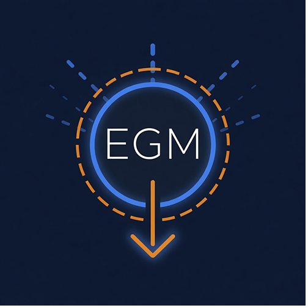
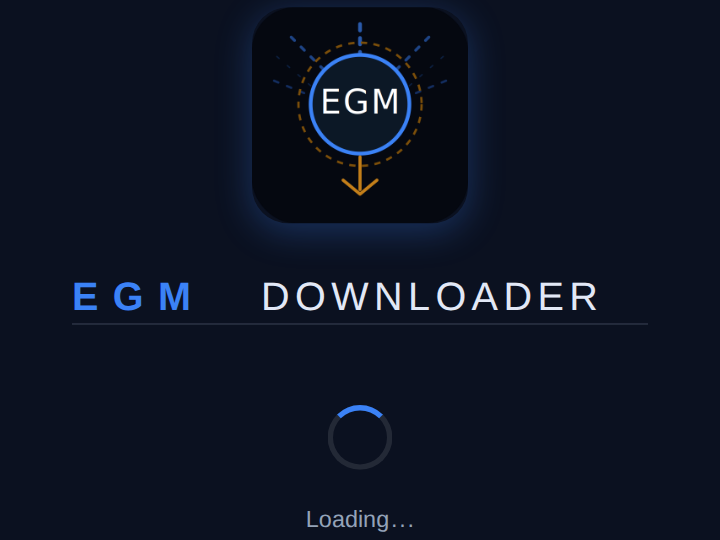
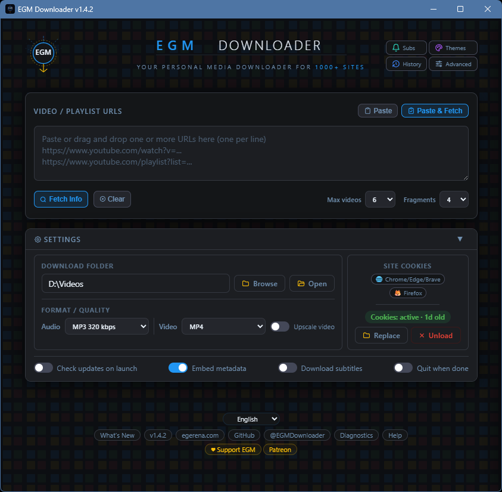
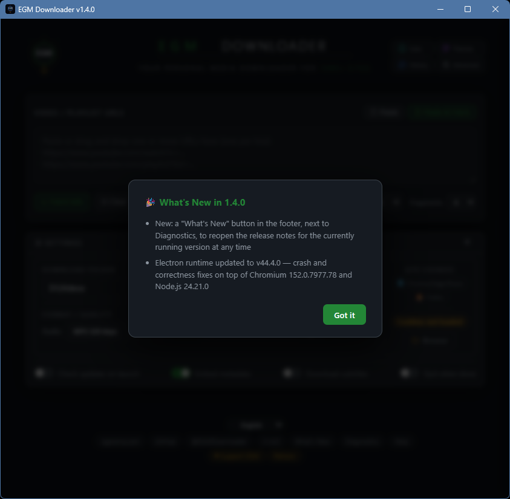

  
  
  <h1>EGM Downloader</h1>
  
  

    
    
    
    
    
    
    
    
    
    
    
    
    
    
  

  
<strong>A powerful, multi-platform video and audio downloader for 1000+ websites.</strong>

  
  
Download videos or extract audio from YouTube, TikTok, Instagram, Twitter, Facebook, and hundreds of other platforms with a beautiful, easy-to-use interface.

  
<em>Powered by yt-dlp · runs locally · no cloud · no tracking · no accounts</em>

---

  <a href="#-download">⬇ Downloads</a> ·
  <a href="#screenshots">📸 Screenshots</a> ·
  <a href="#system-requirements">📋 Requirements</a> ·
  <a href="#roadmap">🗺️ Roadmap</a> ·
  <a href="https://x.com/EGMDownloader">🐦 @EGMDownloader</a>

## ✨ Features

- 🌐 **1000+ Supported Sites** - Download from YouTube, TikTok, Instagram, Twitter, Vimeo, and more
- 🌍 **10 Languages** - English, Arabic, German, Spanish, French, Italian, Japanese, Dutch, Portuguese, and Russian — auto-detected from your system, changeable anytime from the footer
- 🎬 **Video & Audio Downloads** - MP4, MKV, or MP4 H.264 (max compatibility) video; MP3, M4A, OPUS, or FLAC audio
- 📊 **Quality Selection** - Video up to 8K/4K/2K/1080p; audio up to FLAC or 320 kbps MP3
- 🌈 **HDR Downloads** - Videos with HDR10, HDR10+, HLG, or Dolby Vision show as a separate option per resolution; saves as MKV to preserve HDR data untouched
- ⚡ **GPU-Accelerated Conversion** - Video conversion and Upscale use your GPU when available, cutting CPU load and heat dramatically; falls back to software encoding automatically
- 📐 **Upscale to Quality** - Opt-in upscaling proportionally scales videos smaller than your chosen quality preset after download; off by default, adds pixels not detail
- 📋 **Playlist Support** - Download entire playlists with one click
- 📡 **Subscriptions** - Save channels and playlists, auto-fetch new videos, and download with per-channel settings and a live download queue
- 🎨 **500 Themes** - 470 permanent across 32 categories + 30 seasonal themes that rotate throughout the year. If you see fewer than 500, seasonal themes appear during their respective time of year.
- 🎨 **Theme Creator** - Build your own theme with 10 live-preview color pickers, export as `.json`, save directly to your library, favorite alongside built-in themes
- 🖱️ **Drag & Drop + Keyboard Shortcuts** - Drop URLs directly into the app; Ctrl+V / ⌘V fetches, Ctrl+Enter / ⌘Return starts, Esc clears
- 📜 **Download History** - Track all downloads with search, filter, and re-download capability
- 🔤 **Subtitles & Metadata** - Embed subtitles and rich metadata (thumbnail, chapters, title/artist/date) directly into video files
- 💼 **Settings Export / Import** - Back up and restore your settings and subscriptions
- 🔄 **Auto-Updates** - Built-in update checker with SHA256 checksum verification (Windows/Mac)
- 🛠️ **Plugin Updates** - Update yt-dlp, ffmpeg, and optional libraries without reinstalling
- 📋 **Diagnostics** - Live diagnostic log viewer, available from the footer and the Subscriptions window, with optional raw yt-dlp output and export to file for troubleshooting
- 🧹 **Smart Cleanup** - Automatic removal of temporary files and failed downloads
- 💼 **Windows Portable** - Run from any folder or USB drive — no installer, no registry, includes embedded Python
- 🖥️ **Cross-Platform** - Native apps for Windows, macOS, and Linux
- 🔒 **Privacy First** - Runs entirely on your machine. No account required, no cloud processing, no analytics, and no usage tracking. Site cookies are handled locally and never pass through our servers.

---

## 🖼️ Screenshots

> 📸 *Screenshots captured on v1.4.2 — FRONT AND CENTER: RELOADED. The UI is identical across Windows, macOS, and Linux. More screenshots coming soon.*

<table>
  <tr>
    <td align="center" width="33%">
      
       <b>Splash Screen</b>
    </td>
    <td align="center" width="33%">
      
       <b>Main UI</b>
    </td>
    <td align="center" width="33%">
      
       <b>What's New Modal</b>
    </td>
  </tr>
</table>

## 📥 Download

### Windows
🔗 **Platform page:** [windows.egerena.com](https://windows.egerena.com)
**Latest:** v1.4.3 Build 157  
**Download:** [EGMd.zip](https://egerena.com/apps/EGMd.zip) (612 KB · ~800 MB after install)  
**SHA256:** `338e6ad78aea7d03438aed9aceefb7821d8eba6ae4c8c50972726fb91cb88861`  
**Install:** Extract `EGMd.zip`, run `egm-setup.exe` and follow the installer. Then paste a video URL, fetch the info, and click Download.  
**Requirements:** Windows 10/11 (64-bit) · **Python 3.10+** — install from [python.org](https://www.python.org/downloads/) and tick "Add Python to PATH"  
**Code Signed:** Installer is signed with an IV code signing certificate. SmartScreen may show a warning on first run until the certificate builds reputation.
**Auto-Update:** ✅ Built-in update checker with SHA256 verification

### Windows Portable
**Latest:** v1.4.3 Build 157  
**Download:** [EGMd-portable.zip](https://egerena.com/apps/EGMd-portable.zip) (618 KB · ~800 MB after first run)  
**SHA256:** `93b7631111b365e7b0d185ad1923aff29014c79b340fa11279ead1b05a22cb9c`  
**Install:** Extract `EGMd-portable.zip` and run `EGM Downloader.exe`. Settings and data stay in the same folder, so you can take it anywhere.  
**Requirements:** Windows 10/11 (64-bit) · **Python 3.10+** — install from [python.org](https://www.python.org/downloads/) and tick “Add Python to PATH”  
**No installer, no registry** — runs from any folder or USB drive (system Python 3.10+ is used only to bootstrap; the app then downloads a private embedded Python and runs on that. Node, Electron & ffmpeg are fetched on first run)  
**Code Signed:** Portable is signed with an IV code signing certificate. SmartScreen may show a warning on first run until the certificate builds reputation.
**Auto-Update:** ❌ Manual — check the [releases page](https://github.com/egmtm/EGM-Downloader/releases)

### macOS
🔗 **Platform page:** [mac.egerena.com](https://mac.egerena.com)
**Latest:** v1.4.3 Build 157  
**Download:** [EGMdM.zip](https://egerena.com/apps/EGMdM.zip) (141 MB · ~300 MB after install)  
**SHA256:** `babc4e00720a4cea0e5e662ba30377b98a4ce6084ea4a2e908911a37af356b47`  
**Install:** Extract `EGMdM.zip`, open the `.dmg`, drag "EGM Downloader" to Applications, and launch it.  
**Requirements:** macOS 13.0 (Ventura) or later · Apple Silicon (M1–M5) only  
**Signed & Notarized:** This build is Apple notarized — runs without Gatekeeper warnings
**Auto-Update:** ✅ Built-in update checker with SHA256 verification

### Linux
🔗 **Platform page:** [linux.egerena.com](https://linux.egerena.com)
**Latest:** v1.4.3 Build 157  
**Download:** [EGMdL.zip](https://egerena.com/apps/EGMdL.zip) (170 MB · ~300 MB after install)  
**SHA256:** `72fd92c267277c32063ea680ed5411f06bd95396e84d7a333aa691ffc24924d3`  
**Install:** Extract `EGMdL.zip`, make it executable with `chmod +x "EGM Downloader.AppImage"`, then double-click to launch (or run it from a terminal).  
**Format:** AppImage (Universal)  
**Supported Distros:** Ubuntu 20.04+, Mint 20+, Pop!_OS, Fedora 39+, Arch, and more
**Auto-Update:** ❌ Manual — check the [releases page](https://github.com/egmtm/EGM-Downloader/releases)

**Windows only — first launch:** The installer downloads runtime components (Node.js, Electron, ffmpeg) once into your user data directory (~250 MB). macOS and Linux bundle these dependencies inside the package — no first-launch download required (which is why their file sizes are larger).

---

### ⚙️ System Requirements

**Windows:** Windows 10/11 (64-bit) · ~800 MB disk space · Internet on first launch

**macOS:** macOS 13.0+ (Ventura) · Apple Silicon (M1–M5) · ~300 MB disk space

**Linux:** 64-bit distribution · ~300 MB disk space · FUSE support
Supported: Ubuntu 20.04/22.04/24.04/26.04, Mint 20/21/22, Pop!_OS 22.04, Zorin 16/17, elementary 7, Debian 11/12, KDE Neon, Fedora 39/40/41, openSUSE Leap 15.5/Tumbleweed, Rocky/AlmaLinux 9, Arch, Manjaro, EndeavourOS
> Ubuntu 22.04+ may require `libfuse2`: `sudo apt install libfuse2`

---

## 🗺️ Roadmap

**v1.5:**
- ⚡ Electron runtime updated to v45 — the next major runtime upgrade
- 🚫 SponsorBlock integration — an optional toggle to automatically skip sponsor segments in downloaded YouTube videos, powered by the community-run [SponsorBlock](https://sponsor.ajay.app/) database

---

## 💡 Usage

1. **Paste URL** - Copy any video URL and paste it into the app, then click "Fetch". You can also use "Paste & Fetch" to paste and fetch in one step.
2. **Select Format** - Choose video (MP4, MP4 H.264, or MKV) or audio (MP3, M4A, OPUS, or FLAC). MP4 H.264 is the default — maximum compatibility everywhere.
3. **Select Quality** - Choose resolution (up to 8K) or audio bitrate
4. **Edit Filename** (Optional) - Click the filename to customize it
5. **Download** - Click the download button and wait for completion
6. **Open Folder** - Click "Open Folder" to view your downloaded files

### Advanced Features

- **Playlists:** Paste a playlist URL, choose "Download All" (or pick specific videos), then a resolution. "Download All Audio" does the same with your preferred bitrate. Items are processed in sequence.
- **Batch downloads:** Queue multiple URLs, set format and quality for each, start them together, and cancel any individual download anytime.
- **Plugin updates:** "Update Plugins" in the Advanced panel updates yt-dlp (newest site support) and ffmpeg (latest codecs).
- **Cookies / login-required content:** For premium or age-restricted content, import cookies from Chrome, Edge, Brave, or Firefox in the app. They stay on your machine and are never transmitted.
- **Subscriptions:** Follow YouTube channels and playlists and fetch new videos automatically, with per-channel folder, format, and quality settings and one download queue across all channels.
- **Theme Creator:** Press Ctrl+K anywhere in the app. 10 live-preview color pickers recolor the UI in real time; export as `.json` or save to your library.

---

## 📖 The Origin Story

EGM Downloader was born from inspiration and a desire to make video downloading accessible to everyone.

**The inspiration:** [ReClip](https://github.com/averygan/reclip) by [@averygan](https://github.com/averygan) beautifully demonstrated what's possible with yt-dlp and a clean web interface.

**The challenge:** ReClip's self-hosted approach is perfect for developers, but I wanted to share this with friends and family who don't use the terminal. Setting up Python, yt-dlp, ffmpeg, and Flask isn't everyone's cup of tea.

**The solution:** What if you could just download an app and go? No terminal. No dependencies. No setup. Just double-click and start downloading.

That's EGM Downloader—native desktop apps for Windows, macOS, and Linux with professional installers, auto-updates, and zero technical knowledge required.

We've taken the concept in a different direction (native apps vs. web-based, end-users vs. developers), but the core inspiration came from ReClip's elegant simplicity.

**Big thanks to [@averygan](https://github.com/averygan) for ReClip—you sparked the idea that became this project!** 🙏

**This is my first major project, and I'm excited to keep learning and building more tools that make technology accessible to everyone.** 🚀

---

## 🤖 AI Disclosure

EGM Downloader is built by one developer working with AI tools. They help with code, tests, documentation, translations and design assets. Everything that ships is reviewed and approved by a human, and the full source is open for anyone to inspect.

---

## ⚖️ Legal & Responsible Use

EGM Downloader is a tool for downloading video content from the internet. While the software itself is legal, **you are responsible for how you use it.**

### Legitimate Uses

This tool is designed for lawful purposes, including:
- Downloading your own content
- Downloading Creative Commons or public domain content
- Fair use purposes (education, research, criticism, commentary)
- Archiving content you have permission to download
- Backing up content you own or have rights to
- Offline viewing in jurisdictions where personal downloading is legal

### Your Responsibilities

When using this tool, you must:
- **Respect copyright laws** - Only download content you have the right to download
- **Follow Terms of Service** - Many platforms prohibit downloading; check their policies
- **Obtain permission** - When required by law or platform rules
- **Use responsibly** - Do not redistribute, sell, or commercially exploit downloaded content without proper rights

### Disclaimer

**This tool is provided "as-is" for personal, lawful use only.**

The developers:
- Do not encourage or condone copyright infringement
- Are not responsible for how users choose to use this software
- Do not provide legal advice regarding what you can or cannot download
- Assume no liability for user actions or violations of third-party terms

**You are solely responsible for ensuring your use complies with applicable laws, regulations, and terms of service.**

If you're unsure whether your use case is legal, consult a legal professional in your jurisdiction.

---

## 🛠️ For Developers

See [CONTRIBUTING.md](CONTRIBUTING.md) for the project structure, complete build guide, version management workflow, and CI details.

---

## 🏗️ Built With

EGM Downloader is powered by incredible open source projects:

- **[yt-dlp](https://github.com/yt-dlp/yt-dlp)** - Download engine (1000+ sites)
- **[bgutil-ytdlp-pot-provider](https://github.com/Brainicism/bgutil-ytdlp-pot-provider)** - YouTube PO Token generation (proof-of-origin)
- **[yt-dlp/ejs](https://github.com/yt-dlp/ejs)** - EJS remote components for YouTube signature solving
- **[curl_cffi](https://github.com/lexiforest/curl_cffi)** - Browser TLS impersonation for yt-dlp — enables downloads from sites that fingerprint HTTP clients
- **[Flask](https://flask.palletsprojects.com/)** - Web framework
- **[Electron](https://www.electronjs.org/)** - Cross-platform desktop wrapper
- **[FFmpeg](https://ffmpeg.org/)** - Video/audio processing
- **[Deno](https://deno.com/)** - JavaScript runtime for YouTube tokens
- **[mutagen](https://mutagen.readthedocs.io/)** - Audio metadata tagging (thumbnail, chapters, title/artist/date)

See [CREDITS.md](CREDITS.md) for complete acknowledgments and licenses.

---

## 🐛 Troubleshooting

**Windows — app won't start:** Make sure [Python 3.10+](https://www.python.org/downloads/) is installed and on PATH · check the `logs/` folder · for detailed errors, open a command prompt in the app folder and run `python launch.py`

**macOS — download stuck:** Update plugins → restart the app → check Console.app for errors

**Linux — AppImage won't launch:**
- Ensure executable: `chmod +x "EGM Downloader.AppImage"`
- Install FUSE: `sudo apt install libfuse2` (Ubuntu/Debian)
- Run from terminal to see errors

**Need more help?** [Open an issue on GitHub](https://github.com/egmtm/EGM-Downloader/issues)

---

## 📜 License

This project is licensed under the **GNU Affero General Public License v3.0 (AGPL-3.0)** — see the [LICENSE](LICENSE) file for details.

- ✅ Free to use, modify, and distribute under AGPL-3.0 terms
- ✅ Modification and distribution allowed (must share modifications + source)
- ⚠️ Network use triggers copyleft

---

## 📞 Support & Security

- 🐛 **Bug Reports / Feature Requests:** [Open an Issue](https://github.com/egmtm/EGM-Downloader/issues)
- 🐦 **Updates & Announcements:** [@EGMDownloader](https://x.com/EGMDownloader) on X
- 📖 **Contributing:** [Read CONTRIBUTING.md](CONTRIBUTING.md)
- 🔒 **Security Vulnerabilities:** Do not open a public issue — email contact@egerena.com or use [GitHub's private vulnerability reporting](https://github.com/egmtm/EGM-Downloader/security/advisories/new). We aim to respond within 48 hours.
